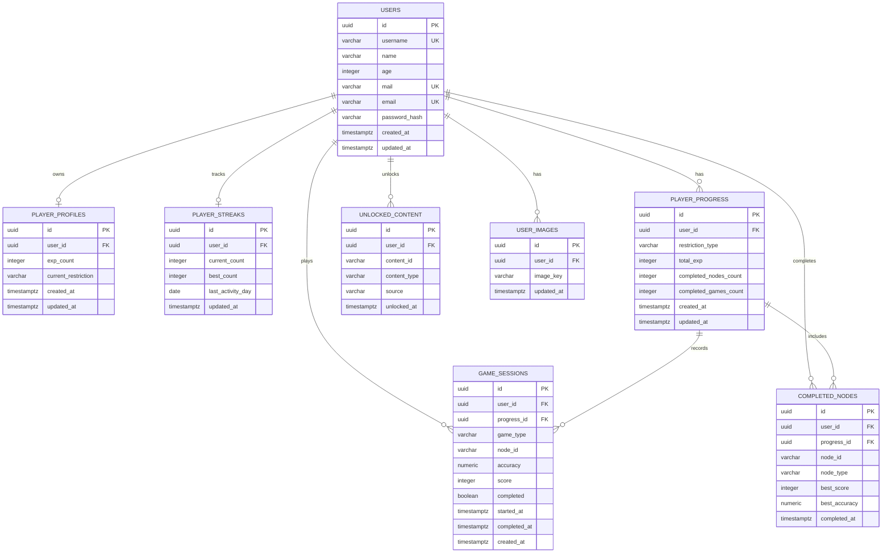

# DER inicial - Persistencia de jugador E-VIDENTE

## Relacion con el Excalidraw

El modelo canonico del backend usa las tablas creadas en la primera PoC de persistencia. Las tablas duplicadas creadas luego quedan como deuda tecnica documentada y no deben usarse para codigo nuevo.

| Excalidraw | Tabla canonica PostgreSQL | Decision |
|---|---|---|
| USER | `users` | `username` queda como identificador funcional unico; `id` UUID es la PK fisica. |
| IMAGE | `user_images` | Imagen/avatar asociada a `users` por `user_id`. |
| PROFILE | `player_profiles` | Perfil 1 a 1 con `users`; acumula experiencia global. |
| STREAK | `player_streaks` | Racha 1 a 1 con `users`. |
| PROGRESO_RESTRICTION | `player_progress` | Progreso acumulado por restriccion alimentaria. |
| HISTORY_GAME / GAME | `game_sessions` | Cada fila representa una partida/sesion jugada. |
| Nodo completado | `completed_nodes` | Nodos terminados por usuario. |
| Desbloqueo | `unlocked_content` | Contenido desbloqueado por usuario. |

## Tablas no canonicas

No usar para features nuevas:

- `images`
- `profiles`
- `streaks`
- `progress_restrictions`
- `history_games`
- `games`

Estas tablas no se borran todavia. Una migracion futura debe verificar datos, migrar si corresponde y eliminarlas solo con autorizacion explicita.

## Decisiones de modelado

- Se usa `UUID` como PK fisica para estabilidad.
- `username` queda como identificador funcional unico.
- Las FK usan UUID en vez de username.
- `users` es la unica tabla para auth.
- `player_profiles` resume experiencia global del jugador.
- `player_streaks` guarda racha actual, mejor racha y ultimo dia de actividad.
- `player_progress` guarda progreso por restriccion (`CELIAQUIA`, `VEG`, `VYG`, `KETO`).
- `game_sessions` registra partidas con tipo, nodo, precision, score y finalizacion.
- `completed_nodes` evita duplicar nodos completados por usuario.
- `unlocked_content` guarda desbloqueos futuros sin conectar Godot todavia.



## Como consultar progreso de jugador

Flujo relacional recomendado:

```sql
SELECT
  u.username,
  pp.exp_count AS profile_exp,
  ps.current_count,
  pg.restriction_type,
  pg.total_exp,
  gs.game_type,
  gs.node_id,
  gs.accuracy,
  gs.score,
  gs.completed
FROM users u
JOIN player_profiles pp ON pp.user_id = u.id
LEFT JOIN player_streaks ps ON ps.user_id = u.id
LEFT JOIN player_progress pg ON pg.user_id = u.id
LEFT JOIN game_sessions gs ON gs.progress_id = pg.id
WHERE u.username = 'demo_player';
```

## Futuro

- Conectar Godot solo cuando el contrato backend este estabilizado.
- Evaluar migracion/limpieza de tablas no canonicas con autorizacion explicita.
- Agregar seeds de demo solo cuando sean necesarios.
- Agregar CI para build, migraciones y test backend.
