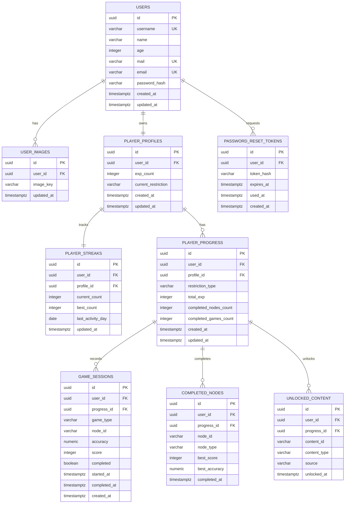

# DER inicial · Persistencia de jugador E-VIDENTE

## Modelo conceptual Excalidraw

El Excalidraw describe el dominio de jugador con estas entidades conceptuales y relaciones:

```
USER
├── IMAGE
└── PROFILE
    ├── STREAK
    └── PROGRESO_RESTRICTION
        └── HISTORY_GAME
            └── GAME
```

Aclaraciones del modelo conceptual:

- `username` es la PK conceptual en el dibujo (identificador visible del jugador).
- En PostgreSQL se usa `id UUID` como PK física para estabilidad ante cambios de username.
- `username` queda como identificador funcional único (`UNIQUE`).
- `PROFILE.id_game` no se implementa como referencia literal porque un perfil puede tener muchas partidas.
- `HISTORY_GAME` y `GAME` se fusionan en `game_sessions` para evitar sobrediseño.

Entidades del Excalidraw:

| Entidad | Atributos conceptuales |
|---|---|
| USER | username (PK), name, age, mail, password, created_at, updated_at |
| IMAGE | id_image (PK), username (FK), updated_at |
| PROFILE | username (FK), id_streak (FK), id_game, exp_count, created_at, updated_at |
| STREAK | id_streak (PK), current_count, best_count, last_activity_day, updated_at |
| PROGRESO_RESTRICTION | id_progreso (PK), username (FK), restriction (CELIAQUIA\|VEG\|VYG\|KETO), created_at, updated_at |
| HISTORY_GAME | id_history (PK), id_progreso (FK), completed |
| GAME | id_game (PK), id_history (FK), accuracy, completed |

En el backend no se crean tablas paralelas para cada nombre conceptual cuando una tabla canónica ya representa esa responsabilidad.

## Modelo fisico PostgreSQL



## Tabla de equivalencias

| Excalidraw | PostgreSQL canónico | Decisión |
|---|---|---|
| USER | `users` | `id` UUID como PK física; `username` unique funcional |
| IMAGE | `user_images` | FK por `user_id` estable |
| PROFILE | `player_profiles` | 1 a 1 con `users` vía `user_id UNIQUE` |
| STREAK | `player_streaks` | 1 a 1 con `player_profiles` vía `profile_id UNIQUE` |
| PROGRESO_RESTRICTION | `player_progress` | Progreso por `profile_id + restriction_type`; UNIQUE(profile_id, restriction_type) |
| HISTORY_GAME | `game_sessions` | Historial de partidas del progreso via `progress_id` |
| GAME | `game_sessions` | Resultado concreto de una sesión (misma tabla) |
| Nodo completado | `completed_nodes` | Nodos terminados por `progress_id`; UNIQUE(progress_id, node_id) |
| Desbloqueo | `unlocked_content` | Desbloqueos por `progress_id`; UNIQUE(progress_id, content_id) |
| Recuperación de contraseña | `password_reset_tokens` | Tokens hasheados, expirables y de un solo uso |

## Tablas no canónicas (PoC)

No usar para features nuevas. No se borran hasta una migración controlada futura.

| Tabla PoC | Tabla canónica equivalente |
|---|---|
| `images` | `user_images` |
| `profiles` | `player_profiles` |
| `streaks` | `player_streaks` |
| `progress_restrictions` | `player_progress` |
| `history_games` | `game_sessions` |
| `games` | `game_sessions` |

## Decisiones de modelado

- Se usa `UUID` como PK física para estabilidad. `username` no se usa como FK física para evitar problemas ante futuros cambios.
- `PROFILE.id_game` literal no se implementa porque un perfil puede tener muchas partidas; `game_sessions` cuelga de `player_progress`.
- `HISTORY_GAME` y `GAME` se representan con `game_sessions` para evitar sobrediseño. Una sesión registra historial y resultado en la misma fila.
- `completed_nodes` y `unlocked_content` usan UNIQUE(progress_id, node_id) y UNIQUE(progress_id, content_id) para permitir que el mismo nodo/contenido exista bajo restricciones distintas del mismo jugador.
- `player_streaks` mantiene `user_id` por compatibilidad, pero la relación canónica es `profile_id`.
- `password_reset_tokens` guarda hashes de tokens. No almacena tokens planos.

## Como consultar progreso de jugador

```sql
SELECT
  u.username,
  pp.exp_count AS profile_exp,
  ps.current_count,
  pg.restriction_type,
  pg.total_exp,
  gs.game_type,
  gs.node_id,
  gs.accuracy,
  gs.score,
  gs.completed
FROM users u
JOIN player_profiles pp ON pp.user_id = u.id
LEFT JOIN player_streaks ps ON ps.profile_id = pp.id
LEFT JOIN player_progress pg ON pg.profile_id = pp.id
LEFT JOIN game_sessions gs ON gs.progress_id = pg.id
WHERE u.username = 'demo_player';
```

## Futuro

- Conectar Godot solo cuando el contrato backend esté estabilizado.
- Evaluar migración/limpieza de tablas no canónicas con autorización explícita.
- Verificar si tablas duplicadas están vacías; migrar datos si existieran; eliminarlas solo con autorización.
- Agregar seeds de demo solo cuando sean necesarios.
- Agregar CI para build, migraciones y test backend.
