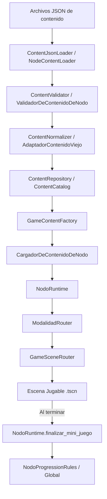

# E-VIDENTE: El Flujo Completo (De JSON a Escena)

¡Hola Trainee! Si querés entender cómo es el camino de la información desde que el mapa lee un archivo `.json` hasta que tu mini-juego (`completar_palabra.tscn`, `pregunta.tscn`, etc.) aparece en pantalla, este es el mapa correcto.

El proyecto está dividido en capas con responsabilidades únicas. Esto nos permite cambiar cómo se ve el menú o cómo se guardan los datos, sin romper el juego en sí.

---

## 1. El Diagrama Real del Flujo

---

## 2. Explicación Trainee: ¿Quién hace qué?

Cada script tiene una sola responsabilidad. Pensalos como empleados de una fábrica:

1. **El JSON (`.json`)**: Describe qué se puede jugar. Es la receta escrita.
2. **El Loader (`ContentJsonLoader`)**: Solo lee archivos del disco. No entiende de juegos, solo lee texto y lo pasa a Diccionario (JSON).
3. **El Validator (`ContentValidator`)**: Solo dice si el diccionario está bien armado o si le faltan cosas.
4. **El Normalizer (`ContentNormalizer` y `AdaptadorContenidoViejo`)**: Convierte nombres viejos o formatos distintos a un formato común estándar para que el resto del juego no sufra bugs.
5. **El Repository (`ContentRepository`)**: Guarda o expone el contenido ya cargado en memoria RAM para no estar leyendo del disco todo el tiempo.
6. **La Factory (`GameContentFactory`)**: Agarra los diccionarios limpios y arma el "Objeto Jugable" final que usará el motor.
7. **El Armador (`CargadorDeContenidoDeNodo`)**: Toma un "Nodo" del mapa y lista qué juegos (actividades) tiene adentro.
8. **El Runtime (`NodoRuntime`)**: Es el director de la partida. Sabe por qué juego vamos (ej: "Estamos en el juego 2 de 3").
9. **El Router de Modalidad (`ModalidadRouter`)**: Traduce los nombres que vienen del JSON (ej: `"drag_food"`) al nombre oficial de la modalidad (`"drag_drop"`).
10. **El Router de Escenas (`GameSceneRouter`)**: Sabe qué archivo `.tscn` abrir para cada modalidad oficial y ejecuta el `change_scene`.
11. **La Escena Jugable (`completar_palabra.gd`)**: ¡Solo juega! Muestra botones, animaciones y letras. No le importa cómo llegó ahí.
12. **El Cierre (`NodoProgressionRules` / `NodoStats`)**: Cuando la escena avisa que terminó, estos scripts calculan los puntos (EXP) y la precisión según los errores.

---

## 3. Diccionario: `type`, `mode` y `runtime_mode`

Para evitar confusiones, es vital entender la diferencia entre estas tres variables que a veces parecen lo mismo:

*   **`type`**: Es el valor que aparece en el JSON del mapa. Indica a nivel macro qué tipo de desafío es este nodo. Ej: El mapa dice `type = "word_options"`. Lo leen los cargadores del mapa.
*   **`mode`**: Es el valor interno que aparece dentro del JSON del nivel/actividad (ej. `opciones_palabras.json`). Ej: El JSON dice `mode = "word_options"`. Lo lee el `ContentJsonLoader`.
*   **`runtime_mode` / `normalized_mode`**: Es la constante oficial (ej: `MODE_COMPLETAR_PALABRA`) ya normalizada por el `ModalidadRouter.gd`. Este es el **único** string que le importa al `GameSceneRouter.gd` para abrir tu escena.

---

## 4. Preguntas Frecuentes (Reduciendo la Magia)

*   **¿Quién llama a esto?** Todo empieza cuando el jugador toca un nodo en el Mapa. Eso invoca al `CargadorDeContenidoDeNodo` que busca en los JSONs.
*   **¿Este mode de dónde sale?** Sale de la propiedad `"mode"` del archivo JSON de la actividad en la carpeta `contenido/actividades/`.
*   **¿Por qué se abre esta escena?** Porque `GameSceneRouter.gd` tiene un diccionario constante `MODE_TO_SCENE_PATH` que vincula el modo normalizado con tu archivo `.tscn`.
*   **¿Quién decide si terminó el nodo?** El `NodoRuntime`. Él lleva la cuenta de cuántos juegos tenía el nodo y por cuál vamos.
*   **¿Dónde se registra el progreso?** En los sistemas globales (ej. `Global.registrar_resultado_mini_juego()`), la escena NUNCA guarda el progreso permanente, solo avisa que terminó.
*   **¿Qué pasa si no hay más mini-juegos?** `NodoRuntime.finalizar_mini_juego()` devuelve `false`. Tu escena, al ver ese `false`, llama a `PostGameFlowController` para salir al mapa.
*   **¿Por qué existen los adapters?** El proyecto tiene formato v1 (viejo) y v2 (nuevo) de JSON. Los adapters permiten que el motor viejo siga funcionando con los JSON viejos sin que tengas que reescribirlos a mano.

---

## 5. Guía para agregar una nueva modalidad (Paso a Paso)

Si te toca programar un mini-juego nuevo, seguí estrictamente esta checklist:

1.  [ ] **Crear contenido JSON**: Armá el JSON con las preguntas o datos de tu nivel en `contenido/actividades/`.
2.  [ ] **Definir `mode`**: Poné `"mode": "mi_juego_nuevo"` en tu JSON.
3.  [ ] **Agregar `type`**: Si el mapa lo requiere, agregá `"type": "mi_juego_nuevo"` en el JSON del mapa.
4.  [ ] **Normalizar en `ModalidadRouter`**: Agregá `const MODE_MI_JUEGO = "mi_juego"` y configuralo en `normalizar_modo()`.
5.  [ ] **Agregar ruta en `GameSceneRouter`**: Agregá la ruta de tu `.tscn` al diccionario `MODE_TO_SCENE_PATH`.
6.  [ ] **Crear tu escena `.tscn`**: Armá la UI.
7.  [ ] **Recibir datos listos**: Tu escena debe leer `Global.obtener_juego_actual_de_partida()` (los datos ya vienen procesados por el Loader/Factory).
8.  [ ] **Registrar resultado**: Al ganar/perder llama a `Global.registrar_resultado_mini_juego(success)`.
9.  [ ] **Cierre de partida**: Llama a `NodoRuntime.finalizar_mini_juego()`.
10. [ ] **Navegación final**: Si el paso anterior devolvió `false`, tu escena delega la navegación a `PostGameFlowControllerScript.navigate_to_return_target`.
