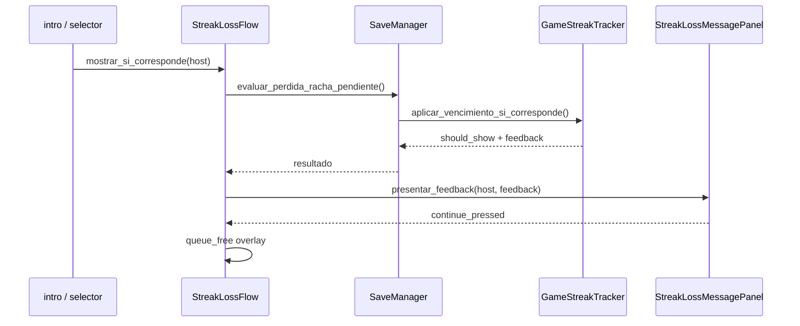

# Módulo de racha diaria (cliente)

Racha diaria, feedback post-partida y aviso in-game de pérdida de racha.

## Capas

| Capa | Archivo | Responsabilidad |
|------|---------|-----------------|
| Dominio | `GameStreakTracker.gd` | Reglas de racha, vencimiento, `construir_feedback_perdida()` |
| Persistencia | `SaveManager.gd` | `evaluar_perdida_racha_pendiente()`, `streak_meta` |
| Flujo pérdida | `StreakLossFlow.gd` | Evalúa si corresponde mostrar overlay y espera cierre |
| Presentación | `StreakLossMessagePanel.gd` + `.tscn` | UI del mensaje de pérdida |
| Vista racha | `ProgressManagerRacha.gd` + `.tscn` | Pantalla de racha y feedback post-partida |
| Integración | `selector.gd`, `intro.gd` | `StreakLossFlow.mostrar_si_corresponde(self)` al entrar |

## Flujo — pérdida de racha in-game



## Dedupe

- `streak_meta.last_loss_notified_for_day` evita mostrar el mismo aviso dos veces.
- Si el jugador pasa por **intro** y luego **selector**, solo ve el overlay una vez por pérdida.

## Qué usa cada escena

| Escena | Uso |
|--------|-----|
| `StreakLossMessagePanel.tscn` | Overlay modal al perder la racha (sin cambiar de escena) |
| `ProgressManagerRacha.tscn` | Ver racha desde HUD, feedback tras completar actividad |

`ProgressManagerRacha` **no** maneja el modo `lost`; eso quedó solo en `StreakLossMessagePanel`.

## Tests (GdUnit4)

Suite: `tests/progress/test_streak_loss_flow.gd`

| Test | Qué valida |
|------|------------|
| `test_construir_feedback_perdida_expone_datos_de_ui` | Payload del dominio |
| `test_panel_muestra_titulo_contador_y_mejor_racha` | Binding UI del panel |
| `test_panel_oculta_mejor_racha_si_no_hay_historial` | Edge case sin best |
| `test_presentar_feedback_remueve_overlay_al_continuar` | Ciclo de vida del overlay |
| `test_save_manager_evaluar_perdida_con_racha_vencida` | Integración SaveManager + vencimiento |

También: `tests/progress/test_racha_sync.gd` (merge, modelo vista, vencimiento).

### Correr

```bash
godot --headless --path juego -s res://addons/gdUnit4/bin/GdUnitCmdTool.gd --ignoreHeadlessMode -a res://tests/progress/
```

Requiere GdUnit4 en `juego/addons/gdUnit4/` (ver `tests/README.md`).

## Smoke manual

1. Dejá una racha con `last_activity_day` de hace 3+ días y `current_count > 0` en el save.
2. Abrí `intro.tscn` o `selector.tscn`.
3. Debería aparecer el overlay con contador en 0 y mejor racha.
4. Tocá continuar → se cierra y no vuelve a mostrarse.
5. Verificá que el feedback post-partida en `ProgressManagerRacha` sigue funcionando.

## Relación con emails (backend)

| Evento | In-game | Email (si `email_notifications_enabled`) |
|--------|---------|------------------------------------------|
| Racha en riesgo (ayer jugó, hoy no) | Badge warning en HUD | `streak_at_risk` (cron) |
| Racha perdida (2+ días) | `StreakLossMessagePanel` | `streak_lost` (cron) |
| Registro | — | `welcome` (transaccional) |

Ver `BACKEND/src/modules/email/README.md`.
