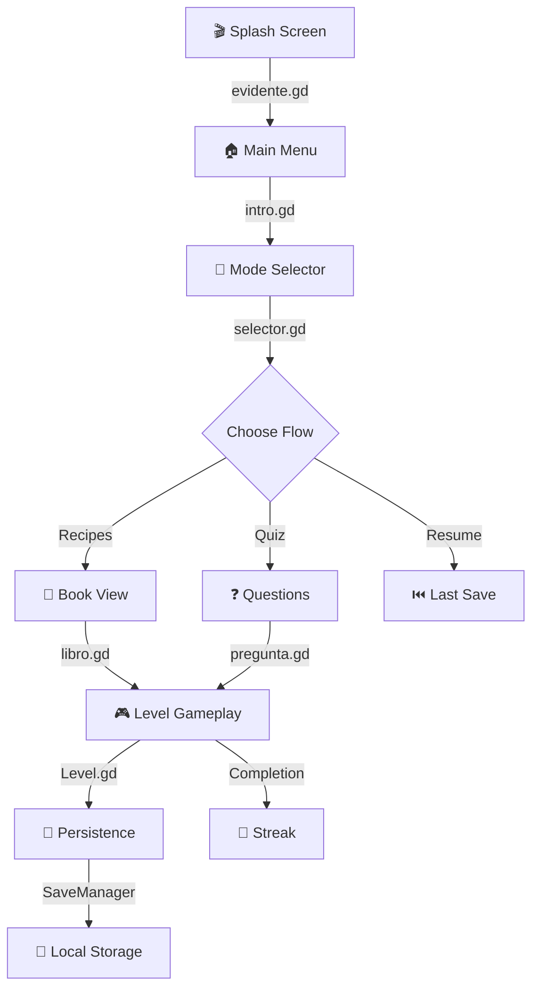
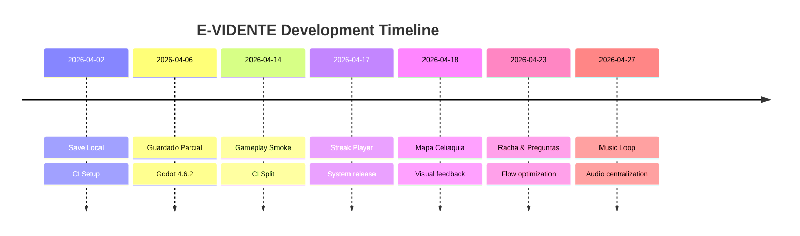

# 🏗️ Propuesta: Wiki Moderna con GitHub Native Features

## Opciones Modernas Disponibles

### 1. 📊 MERMAID DIAGRAMS (GitHub lo soporta nativamente)



**Ventajas**:
- Visualización clara del flujo
- Se actualiza automáticamente
- Legible incluso sin internet (está en PNG cuando se renderiza)
- Profesional y moderno

---

### 2. 🎨 CARDS CON HTML (GitHub lo permite)

```markdown
# Sistemas Principales

<table>
<tr>
  <td width="50%">
    <h3>🎵 Audio Manager</h3>
    <p><strong>Archivo</strong>: <code>managers/MusicManager.gd</code></p>
    <p>Gestiona música centralizada con loop automático en sesiones prolongadas.</p>
    <p>✅ Sin silencios | ✅ Sin solapamiento | ✅ Control de volumen</p>
    <p><a href="CHANGELOG.md#audio">Ver detalles</a></p>
  </td>
  <td width="50%">
    <h3>💾 Save Manager</h3>
    <p><strong>Archivo</strong>: <code>interface/SaveManager.gd</code></p>
    <p>Único punto de entrada para persistencia local.</p>
    <p>✅ Multi-sesión | ✅ Compatibilidad legacy | ✅ Respaldo automático</p>
    <p><a href="Persistencia-Local.md">Ver detalles</a></p>
  </td>
</tr>
<tr>
  <td width="50%">
    <h3>🎮 Game Router</h3>
    <p><strong>Archivo</strong>: <code>niveles/GameSceneRouter.gd</code></p>
    <p>Hub central de navegación entre escenas.</p>
    <p>✅ Sin change_scene() repartido | ✅ Context passing | ✅ Trazable</p>
    <p><a href="Architecture.md#navegacion">Ver detalles</a></p>
  </td>
  <td width="50%">
    <h3>🏃 Streak Tracker</h3>
    <p><strong>Archivo</strong>: <code>niveles/progress/GameStreakTracker.gd</code></p>
    <p>Regla de negocio de racha diaria.</p>
    <p>✅ Timestamps Unix | ✅ View model limpio | ✅ Observable</p>
    <p><a href="Architecture.md#racha">Ver detalles</a></p>
  </td>
</tr>
</table>
```

**Ventajas**:
- Visual, profesional, moderno
- Links internos funcionales
- Badges de estado rápido
- Fácil de scanear

---

### 3. 🗺️ ARCHITECTURE DECISION RECORDS (ADR)

**Concepto**: Archivo por decisión importante. Escalable a infinito.

```markdown
# ADR-001: MusicManager Centralizado

**Estado**: Aprobado ✅  
**Fecha**: 2026-04-27  
**Stakeholders**: @Agusdiisanto

## Problema
Sesiones prolongadas causaban silencios inesperados cuando la música terminaba.

## Alternativas Consideradas
1. Loop en AudioStreamPlayer de cada escena (descartada - duplicación)
2. Autoload global con detector de fin (✅ elegida)
3. Playlist infinita (descartada - requiere rebuild de assets)

## Decisión
Crear autoload `MusicManager` que:
- Detecta fin de pista automáticamente
- Reinicia sin interrupciones
- Centraliza control de volumen

## Impacto
- 7 escenas refactorizadas
- 10% reducción de código de audio
- 0 breaking changes

## Alternativas Futuras
- Transiciones suaves entre tracks
- Sistema de mezcla (crossfade)

---

# ADR-002: Sistema de Persistencia Multi-Sesión

...
```

**Ventajas**:
- Cada decisión es un archivo pequeño
- Fácil de buscar y mantener
- Histórico de por qué se hizo algo
- **ESCALA**: 100 decisiones = 100 archivos cortos (no 1 gigante)

---

### 4. 📋 TABLA INTERACTIVA "DÓNDE TOCAR QUÉ"

```markdown
## 🎯 Mapa de Cambios

| Feature | Archivo(s) | Complejidad | Links |
|---------|-----------|-------------|-------|
| 🎵 Cambiar música | `MusicManager.gd` | ⭐ | [Código](../project/managers/MusicManager.gd) \| [ADR-001](adr/ADR-001.md) |
| 📖 Agregar capítulo | `GameTrackCatalog.gd` | ⭐⭐ | [Docs](Persistencia-Local.md) \| [PR #12](https://github.com/.../pulls/12) |
| 🎮 Nueva mecánica | `mechanics/` | ⭐⭐⭐ | [Tutorial](Getting-Started.md) \| [Ejemplo](../project/niveles/mechanics/) |
| 💾 Cambiar save format | `SaveManager.gd` | ⭐⭐⭐⭐ | [Docs](Persistencia-Local.md) \| [Legacy](../project/interface/save_local/data/) |
| 🌈 Colores/Paleta | `colours/miPaleta.gd` | ⭐ | [Asset](../project/colours/) |
```

---

### 5. 🌳 TREE VISUAL CON EMOJIS

```markdown
## Estructura del Proyecto

```
📦 project/
├── 🎬 interface/
│   ├── evidente.gd              (Splash inicial)
│   ├── intro.gd                 (Menú principal)
│   ├── libro.gd                 (Selector capítulos)
│   ├── Archivero.gd             (Hub guardado)
│   ├── SaveManager.gd           (⭐ Persistencia centralizada)
│   ├── components/
│   │   ├── Racha.tscn           (Badge HUD)
│   │   └── ProgressManagerRacha.tscn (Pantalla racha)
│   └── save_local/
│       ├── data/                (Normalización payloads)
│       ├── progress/            (Progreso y sesiones)
│       └── persistence/         (I/O a disco)
│
├── 🎮 niveles/
│   ├── intro.gd                 (Menú)
│   ├── selector.gd              (Selector modos)
│   ├── GameSceneRouter.gd       (⭐ Hub navegación)
│   ├── GameTrackCatalog.gd      (Catalogo de tracks)
│   ├── global.gd                (⭐ Estado runtime)
│   ├── nivel_1/
│   │   ├── Level.gd             (Shell común)
│   │   └── ...
│   ├── manager_level.gd         (Orquestador runtime)
│   ├── progress/
│   │   └── GameStreakTracker.gd (Racha)
│   ├── mechanics/
│   │   └── PlateSortMechanicController.gd (Gameplay)
│   └── ...
│
├── 🍎 items/
│   └── *.tres                   (Alimentos - verdad única)
│
├── ❓ preguntas/
│   ├── pregunta.gd
│   ├── *.tres                   (Recursos de preguntas)
│   └── ...
│
├── 🗺️ mapas/
│   ├── MapScene.gd
│   ├── LevelNode.gd
│   └── LevelManager.gd
│
├── 🎨 colours/
│   └── miPaleta.gd              (Paleta única)
│
└── 🔊 assets-sistema/
    ├── sonidos/
    ├── iconos/
    └── ...

⭐ = Archivos clave para entender el proyecto
```

---

### 6. 🔔 BADGES Y ESTADOS VISUALES

```markdown


## Sistemas por Estado

| Sistema | Status | Last Update | Responsable |
|---------|--------|-------------|-------------|
| Audio Manager | 🟢 Stable | 2026-04-27 | @Agusdiisanto |
| Music Loop | 🟢 Stable | 2026-04-27 | @Agusdiisanto |
| Save Local | 🟢 Stable | 2026-04-06 | @Agusdiisanto |
| Streak System | 🟢 Stable | 2026-04-17 | @Agusdiisanto |
| Map Celiaquia | 🟡 In Progress | 2026-04-18 | @Agusdiisanto |
```

---

### 7. 📈 TIMELINE VISUAL



---

### 8. 🔍 BITÁCORA MODERNA CON FILTROS

```markdown
## Cambios por Categoría

### 🎵 Audio
- [2026-04-27] **Music Loop** - Autoplay en sesiones prolongadas [#17](../pulls/17)
- [2026-04-02] **Sound Manager** - Setup inicial de audio [#1](../pulls/1)

### 🎨 UI
- [2026-04-23] **Racha & Preguntas** - Flow optimization [#14](../pulls/14)
- [2026-04-15] **Animaciones** - Componentes más vivos [#10](../pulls/10)

### 💾 Persistencia
- [2026-04-18] **Mapa + Feedback** - Visual state system [#13](../pulls/13)
- [2026-04-06] **Guardado Parcial** - Quick save por track [#8](../pulls/8)

### ⚙️ Infraestructura
- [2026-04-14] **CI Split** - Pipelines organizadas [#11](../pulls/11)
- [2026-04-02] **CI Baseline** - Validación core [#2](../pulls/2)
```

---

## 📋 Propuesta de Nueva Estructura Wiki

```
Home.md
  ↓
├── Architecture.md (visual con Mermaid + tree + cards)
├── Bitacora.md (categorizado con badges)
├── CHANGELOG.md (detalles por PR)
├── ADR/ (carpeta con decisiones)
│   ├── ADR-001-MusicManager.md
│   ├── ADR-002-Persistence.md
│   └── ADR-003-...md
├── Getting-Started.md
├── Persistencia-Local.md
└── CI.md
```

---

## Ejemplo: Architecture.md Moderno

```markdown
# 🏗️ E-VIDENTE Architecture

> Guía visual y estructurada de cómo funciona el proyecto.

## En 2 Minutos

[Diagrama Mermaid de flujo]
[Cards visuales de sistemas]
[Tree de carpetas]

## En 10 Minutos

[Tabla "dónde tocar qué"]
[ADRs relacionadas]
[Links a documentación]

## Deep Dive

[Cada sistema con ejemplos]
[Decisiones de arquitectura]
[Alternativas consideradas]
```

---

## ✅ Ventajas de este Sistema

- **Moderno**: Diagramas, cards, badges
- **Escalable**: ADR = archivos pequeños, no mega-documentos
- **Navegable**: Links internos y breadcrumbs claros
- **Visual**: Emojis, colores, estructura clara
- **Profesional**: Estándar de industria (ADR es usado por Google, Netflix, etc)
- **Mantenible**: Cada cambio = 1 archivo pequeño
- **Buscable**: Badges + categorías + tags

---

## 🚀 Plan de Implementación

1. **Crear carpeta `adr/`** con primeras decisiones importantes
2. **Refactor Architecture.md** con Mermaid + Tree + Cards
3. **Reorganizar Bitacora.md** con categorías y badges
4. **Crear CHANGELOG.md** indexado por versión
5. **Actualizar Home.md** como punto de entrada visual

**Tiempo**: ~2 horas
**Resultado**: Wiki de nivel profesional que crece sin explotar
