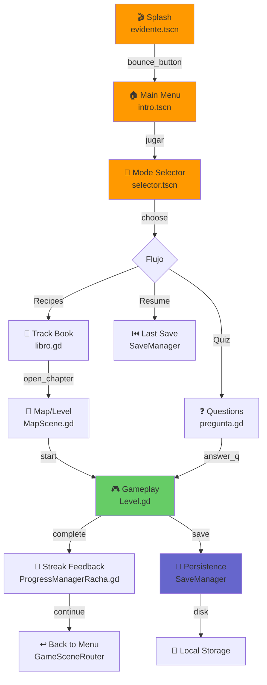
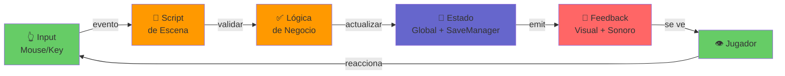

# 🏗️ E-VIDENTE Architecture

> Guía visual y estructurada de cómo funciona el proyecto.  
> **Para decisiones arquitectónicas**, ver [ADR/](adr/).  
> **Para cambios recientes**, ver [CHANGELOG](CHANGELOG.md).

---

## 🎯 En 2 Minutos (El Flujo)



---

## 📁 Estructura del Proyecto

```
📦 project/
│
├─ 🎬 interface/ (UI & Navegación)
│  ├─ evidente.gd ..................... Splash inicial (animado)
│  ├─ evidente.tscn
│  ├─ intro.gd ....................... Menú principal
│  ├─ intro.tscn
│  ├─ libro.gd ....................... Selector de capítulos por track
│  ├─ libro*.tscn
│  ├─ Archivero.gd ................... Hub de guardado y acceso a tracks ⭐
│  ├─ archivero.tscn
│  ├─ opciones.gd .................... Pantalla de opciones
│  ├─ opciones.tscn
│  ├─ SaveManager.gd ................. ⭐ PUNTO ÚNICO DE PERSISTENCIA
│  │
│  ├─ components/
│  │  ├─ Racha.tscn .................. Badge pequeño en HUD
│  │  ├─ ProgressManagerRacha.gd ...... Pantalla completa de racha
│  │  ├─ ProgressManagerRacha.tscn
│  │  ├─ ProfileOverlayPanel.gd ....... Overlay de perfil
│  │  └─ ...
│  │
│  └─ save_local/ (Sistema de Persistencia)
│     ├─ data/ ....................... Normalización de payloads legacy
│     ├─ progress/ ................... Sesiones y historial
│     └─ persistence/ ................ I/O a disco
│
├─ 🎮 niveles/ (Gameplay & Catálogo)
│  ├─ intro.gd ....................... Menú principal (duplica interfaz/intro.gd)
│  ├─ selector.gd .................... Selector de modos (alternativa)
│  ├─ GameSceneRouter.gd ............. ⭐ HUB CENTRAL DE NAVEGACIÓN
│  ├─ GameTrackCatalog.gd ............ Catálogo de 4 tracks (celiaquia, veganismo, etc)
│  ├─ global.gd ...................... ⭐ ESTADO RUNTIME EN MEMORIA
│  │
│  ├─ nivel_1/
│  │  ├─ Level.gd .................... Shell común jugable ⭐
│  │  ├─ level_celiaquia.tres ........ Config de nivel
│  │  └─ ...
│  │
│  ├─ manager_level.gd ............... Orquestador runtime de partida
│  │
│  ├─ progress/
│  │  └─ GameStreakTracker.gd ........ Lógica de racha diaria
│  │
│  ├─ mechanics/
│  │  └─ PlateSortMechanicController.gd Mecánica actual (ordenar alimentos)
│  │
│  └─ ...
│
├─ 🍎 items/ (Alimentos)
│  └─ *.tres ......................... ⭐ CADA ALIMENTO ES UN RESOURCE
│                                      (verdad única de propiedades)
│
├─ ❓ preguntas/ (Sistema Quiz)
│  ├─ pregunta.gd .................... Controlador de preguntas
│  ├─ pregunta.tscn
│  ├─ Preguntas*.tres ................ Resources de preguntas
│  └─ ...
│
├─ 🗺️ mapas/ (Sistema Mapa)
│  ├─ MapScene.gd .................... Escena del mapa
│  ├─ MapScene.tscn
│  ├─ LevelNode.gd ................... Nodo clickeable de capítulo
│  └─ LevelManager.gd ................ Estado de desbloqueo (Celiaquia)
│
├─ 🎨 colours/
│  └─ miPaleta.gd .................... ⭐ PALETA ÚNICA DEL PROYECTO
│
├─ 🔊 managers/
│  └─ MusicManager.gd ................ ⭐ GESTOR CENTRALIZADO DE AUDIO
│
├─ 🎬 assets-sistema/
│  ├─ sonidos/ ....................... Música, SFX
│  ├─ iconos/ ........................ Sprites de UI
│  ├─ interfaz/ ...................... Assets de botones, etc
│  └─ ...
│
├─ 📚 resources/
│  └─ *.tres ......................... Configuración general
│
├─ 🧪 tests/
│  └─ *.gd ........................... Tests headless (CI)
│
├─ project.godot .................... Config del proyecto
└─ export_presets.cfg ............... Presets de export

⭐ = Archivos clave para entender el proyecto
```

---

## 🎯 Qué Tocar Según Qué Quieras Cambiar

| Quiero cambiar... | Toco aquí | Complejidad | Detalles |
|---|---|---|---|
| 🎵 Música de fondo | `managers/MusicManager.gd` | ⭐ | [ADR-001](adr/ADR-001-MusicManager.md) \| API: `reproducir_musica()` |
| 🏠 Menú principal | `interface/intro.gd` | ⭐ | Botones, animaciones, eventos |
| 🎯 Selector de modos | `interface/selector.gd` | ⭐ | UI de 6 botones + resume |
| 📖 Libros/Capítulos | `interface/libro.gd` | ⭐ | Generador dinámico de botones |
| 🎮 Flujo de nivel | `niveles/nivel_1/Level.gd` | ⭐⭐ | Shell común, evento run_completed |
| 🎮 Mecánica gameplay | `niveles/mechanics/PlateSortMechanicController.gd` | ⭐⭐⭐ | Validación, feedback, scoring |
| 💾 Guardado local | `interface/SaveManager.gd` | ⭐⭐⭐ | Serialización, compatibilidad |
| 📊 Progreso/Racha | `niveles/global.gd` | ⭐⭐ | Métodos: `is_level_completed()`, etc |
| 🏃 Racha diaria | `niveles/progress/GameStreakTracker.gd` | ⭐ | Lógica timestamps, view model |
| 🗺️ Mapa visual | `mapas/MapScene.gd` | ⭐⭐ | Estados visuales, desbloqueo |
| 🍎 Alimentos/Condiciones | `items/*.tres` | ⭐ | Resource de propiedades |
| 🌈 Colores/Paleta | `colours/miPaleta.gd` | ⭐ | Valores RGBA, única fuente |
| 🎛️ Catálogo de tracks | `niveles/GameTrackCatalog.gd` | ⭐⭐ | 4 tracks: celiaquia, veganismo, etc |
| 🔄 Navegación entre escenas | `niveles/GameSceneRouter.gd` | ⭐ | Métodos: `go_to_map()`, `go_to_level()`, etc |
| 🔧 CI/Deploy | `.github/workflows/` | ⭐⭐⭐ | Pipelines, headless validation |

---

## 🌊 Flujo de Datos



---

## 🎨 Sistemas Principales

<table>
<tr>
<td width="50%">

### 🎵 Audio

**Archivo**: `managers/MusicManager.gd` ⭐  
**Tipo**: Autoload global

Gestor centralizado de reproducción. Detecta fin de pista automáticamente y reinicia sin interrupciones.

✅ Loop automático  
✅ Control de volumen  
✅ Transiciones suaves  

**Métodos clave**:
```gdscript
reproducir_musica(ruta: String)
establecer_volumen(lineal: float)
pausar_musica() / reanudar_musica()
```

[ADR-001: MusicManager](adr/ADR-001-MusicManager.md)

</td>
<td width="50%">

### 💾 Persistencia

**Archivo**: `interface/SaveManager.gd` ⭐  
**Tipo**: Autoload global

Punto único de entrada para guardado local.  
Expone perfil, progreso, historial y resume.

✅ Multi-sesión  
✅ Compatibilidad legacy  
✅ Respaldo automático  

**Métodos clave**:
```gdscript
load_data()
save_data()
set_resume_to_level(track, level)
is_level_completed(track, level)
```

[Más detalles](Persistencia-Local.md)

</td>
</tr>

<tr>
<td width="50%">

### 🎮 Navegación

**Archivo**: `niveles/GameSceneRouter.gd` ⭐  
**Tipo**: Script estático

Hub central que concentra todos los `change_scene_to_file()` en un solo lugar. Pasaje de contexto por meta.

✅ Trazable  
✅ Sin duplicación  
✅ Context passing  

**Métodos clave**:
```gdscript
go_to_main_menu(tree)
go_to_map(tree)
go_to_track_book(tree, track_key)
go_to_track_level(tree, track_key, level)
go_to_streak(tree, context)
```

[Usar GameSceneRouter](Architecture.md#navegacion)

</td>
<td width="50%">

### 🏃 Racha Diaria

**Archivo**: `niveles/progress/GameStreakTracker.gd` ⭐  
**Tipo**: Lógica pura

Regla de negocio: +1 si juega al día siguiente, reset si no.  
Timestamps Unix para precisión.

✅ Determinístico  
✅ Observable  
✅ View model limpio  

**Lógica**:
```
diff_days = (today - last_date) / 86400
if diff_days == 1: streak += 1
elif diff_days != 0: streak = 1
```

[Ver en Bitácora](Bitacora.md#racha-diaria)

</td>
</tr>

<tr>
<td width="50%">

### 🍎 Alimentos

**Archivo**: `items/*.tres`  
**Tipo**: Resource

Cada alimento es un `.tres` con propiedades  
(gluten, lactosa, vegano, etc).

✅ Verdad única  
✅ Data-driven  
✅ Fácil de extender  

**Propiedades**:
- condiciones (array de ints)
- allowed_track_keys / blocked_track_keys
- nombre, descripción, texture

[Entender items](Architecture.md#alimentos)

</td>
<td width="50%">

### 🌈 Paleta

**Archivo**: `colours/miPaleta.gd`  
**Tipo**: Resource

Punto único de colores del proyecto.  
Cambios aquí = cambios globales.

✅ Consistencia  
✅ Fácil de mantener  
✅ DRY (Don't Repeat Yourself)  

**Cómo usar**:
```gdscript
var color = miPaleta.naranja_tierra
modulate = color
```

[Asset en proyecto](../project/colours/)

</td>
</tr>
</table>

---

## 🚀 Onboarding: Cómo Leer el Código

**Si tienes 10 minutos**:
1. Lee este archivo (Architecture.md)
2. Mira el diagrama Mermaid arriba
3. Busca tu cambio en la tabla "Qué tocar"

**Si tienes 30 minutos**:
1. Lee [Home.md](Home.md) completo
2. Lee `interface/evidente.gd` hasta `_ready()`
3. Lee `niveles/GameSceneRouter.gd` todo
4. Entiende dónde vive cada cosa

**Si tienes 1 hora** (deep dive):
1. Sigue este orden:
   - `interface/evidente.gd` (arranque)
   - `niveles/intro.gd` (menú)
   - `niveles/selector.gd` (selector)
   - `interface/SaveManager.gd` (persistencia)
   - `interface/libro.gd` (capítulos)
   - `niveles/nivel_1/Level.gd` (gameplay)
   - `niveles/manager_level.gd` (orquestación)

2. Complementa con docs:
   - [Persistencia Local](Persistencia-Local.md) - Deep dive save
   - [CHANGELOG](CHANGELOG.md) - Qué cambió
   - [ADR/](adr/) - Decisiones arquitectónicas

---

## 📚 Documentación Adicional

| Documento | Propósito | Cuándo leer |
|-----------|-----------|-----------|
| [Home.md](Home.md) | Índice y punto de entrada | Primero |
| [Getting-Started.md](Getting-Started.md) | Setup y primeros pasos | Si eres nuevo |
| [Persistencia-Local.md](Persistencia-Local.md) | Deep dive de save local | Trabajando con saves |
| [CI.md](CI.md) | Pipelines y validación | Contribuyendo a main |
| [CHANGELOG.md](CHANGELOG.md) | Cambios detallados | Buscando qué cambió |
| [adr/](adr/) | Decisiones arquitectónicas | Entendiendo "por qué" |
| [Bitacora.md](Bitacora.md) | Resúmenes ejecutivos | Visión general rápida |

---

## 🏛️ Convenciones de Código

### Nombres
- Explícito > Críptico
- `background_music` > `bgm`
- `_play_level_audio()` > `_playAudio()`

### Estructura de Scripts
```gdscript
extends Node
class_name MyClass

# === Signals ===
signal event_happened

# === Constants ===
const SOME_VALUE = 42

# === Exports ===
@export var configurable := 0

# === Private Variables ===
var _state := "inicial"

# === Lifecycle ===
func _ready() -> void:
    pass

# === Public API ===
func do_something() -> void:
    pass

# === Private Helpers ===
func _helper() -> void:
    pass
```

### Comentarios
- `## descripción` para comentarios de docstring
- `# descripción` para lógica compleja
- Evitar obvio: `# increment x` ❌

---

## 🔗 Links Clave

- **Repo**: https://github.com/TTIP-e-vidente/e-vidente
- **CI**: `.github/workflows/`
- **Build Local**: Ver [Getting-Started.md](Getting-Started.md)
- **Godot Docs**: https://docs.godotengine.org/en/stable/
- **GDScript**: https://docs.godotengine.org/en/stable/tutorials/scripting/gdscript/index.html
