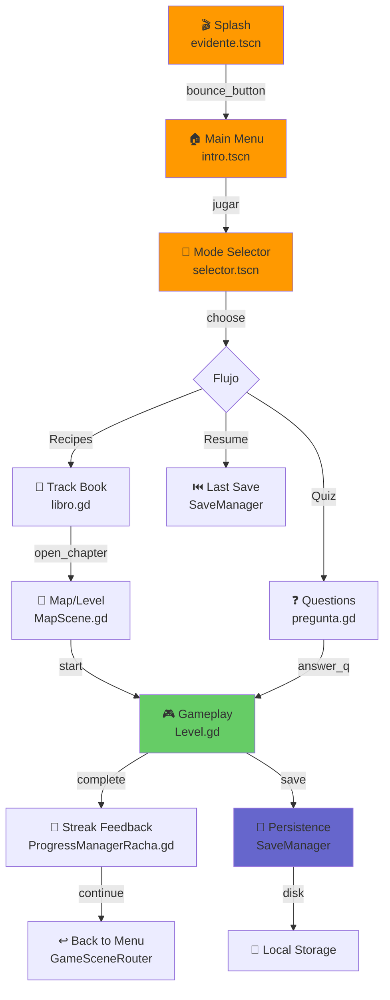
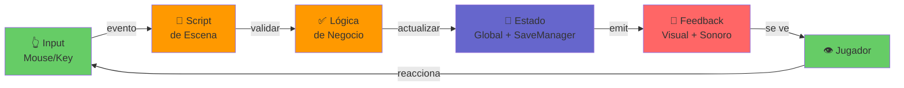

# 🏗️ Cómo Funciona E-VIDENTE

Te mostramos visualmente cómo está armado el proyecto, dónde vive cada cosa importante, y cómo todo se conecta.

> Si necesitás entender "por qué" de cambios grandes, mirá los [ADR/](adr/).  
> Si necesitás saber qué cambió últimamente, mirá [Bitacora.md](Bitacora.md).

---

## El Flujo en 2 Minutos

Así funciona el juego desde que lo abrís:

1. Primero ves el splash (la pantalla de bienvenida con el logo animado)
2. Después el menú principal
3. Elegís qué querés hacer: jugar, preguntas, o retomar donde dejaste
4. Si jugás, ves un mapa, entras a un nivel, y jugás
5. Al terminar, se guarda todo en el disco y ves la pantalla de racha

Acá está el diagrama visualizado:



---

## Ruta Rápida Para Exponer (5 Minutos)

Si esto lo vas a mostrar en clase, seguí este orden:

1. Diagrama principal de flujo (arriba): explica el recorrido completo.
2. Tabla de "Si necesitás cambiar algo": muestra cómo ubicarse rápido en el código.
3. Sistemas clave: audio, guardado, navegación y racha.

Con esa secuencia, cualquiera entiende el proyecto sin perderse en detalles técnicos.

---

## Dónde Vive Cada Cosa

Versión corta para ubicarte rápido:

| Área | Componentes principales | Para qué sirve |
|---|---|---|
| Entrada y Menú | `interface/evidente.gd`, `interface/intro.gd`, `niveles/selector.gd` | Arranque y navegación inicial |
| Progreso y Guardado | `interface/SaveManager.gd`, `niveles/global.gd`, `interface/save_local/*` | Guardar, recuperar y consultar avance |
| Gameplay | `niveles/nivel_1/Level.gd`, `niveles/manager_level.gd`, `niveles/mechanics/*` | Flujo jugable y lógica de mecánicas |
| Preguntas | `preguntas/pregunta.gd`, `preguntas/json_nodos/*.json`, `preguntas/QuestionJsonLoader.gd` | Quiz y contenido de preguntas |
| Mapa | `mapas/MapScene.gd`, `mapas/LevelNode.gd`, `mapas/MapNodeData.gd` | Navegación visual por capítulos |
| Audio | `managers/MusicManager.gd` | Música de fondo y continuidad |
| UI de progreso | `interface/components/Racha.tscn`, `interface/components/ProgressManagerRacha.gd` | Feedback de racha y estado |

Si necesitás detalle carpeta por carpeta, se puede expandir en una sección aparte. Por ahora dejamos lo esencial para que sea más fácil de leer.

---

## Si Necesitás Cambiar Algo, ¿Por Dónde Empiezo?

Acá te decimos "si querés cambiar X cosa, toca este archivo":

| Si querés cambiar... | Toca aquí | Dificultad | Dónde está el detalle |
|---|---|---|---|
| 🎵 La música de fondo | `managers/MusicManager.gd` | ⭐ fácil | Ver resumen en [Bitacora.md](Bitacora.md) |
| 🏠 El menú principal (botones, colores, etc) | `interface/intro.gd` | ⭐ fácil | Solo UI, nada de lógica |
| 🎯 El selector de modos | `interface/selector.gd` | ⭐ fácil | Botones + eventos |
| 📖 Los libros / selección de capítulos | `interface/libro.gd` | ⭐ fácil | Genera botones dinámicamente |
| 🎮 Cómo funciona un nivel (lo que ves cuando jugás) | `niveles/nivel_1/Level.gd` | ⭐⭐ medio | Es el template para todos los niveles |
| 🎮 La mecánica de gameplay (validación de comida, scoring) | `niveles/mechanics/PlateSortMechanicController.gd` | ⭐⭐⭐ difícil | Lógica compleja |
| 💾 Cómo guardamos el progreso | `interface/SaveManager.gd` | ⭐⭐⭐ difícil | Serialización y compatibilidad |
| 📊 El progreso que ves en pantalla | `niveles/global.gd` | ⭐⭐ medio | Métodos para preguntar si completaste cosas |
| 🏃 La racha diaria (contadores, lógica) | `niveles/progress/GameStreakTracker.gd` | ⭐ fácil | Timestamps + regla simple |
| 🗺️ El mapa visual | `mapas/MapScene.gd` | ⭐⭐ medio | Cómo se ve cada nivel, si está desbloqueado |
| 🍎 Los alimentos (propiedades, condiciones) | `items/*.tres` | ⭐ fácil | Son Resources con datos |
| 🌈 Los colores de la app | `colours/miPaleta.gd` | ⭐ fácil | Cambias acá y cambia todo |
| 🎛️ El catálogo de tracks (celiaquia, veganismo, etc) | `niveles/GameTrackCatalog.gd` | ⭐⭐ medio | 4 tracks: define cuál es cuál |
| 🔄 Navegar entre pantallas | `niveles/GameSceneRouter.gd` | ⭐ fácil | Todos los `change_scene` en un lugar |
| 🔧 Cómo se valida el proyecto automáticamente | `.github/workflows/` | ⭐⭐⭐ difícil | Pipelines complejos |

---

## Cómo Fluyen los Datos

Esto es simplificado, pero así es cómo funciona:



---

## Los 6 Sistemas Clave

### 🎵 Audio - Música Centralizada

**Dónde**: `managers/MusicManager.gd` ⭐  
**Qué hace**: Un solo gestor que maneja toda la música del juego. Cuando termina una canción, la reinicia automáticamente. Sin silencios incómodos en sesiones largas.

**Lo importante**:
- Música se reinicia sola
- Controlás volumen desde un lugar
- Transiciones suaves

**Cómo se usa**:
```gdscript
MusicManager.reproducir_musica("ruta/cancion.ogg")
MusicManager.establecer_volumen(0.8)
```

[Resumen del cambio](Bitacora.md#lo-que-pasó-recientemente)

---

### 💾 Persistencia - Dónde Guardamos Todo

**Dónde**: `interface/SaveManager.gd` ⭐  
**Qué hace**: Punto único por donde pasa TODO lo que guardamos. Perfil, progreso, historial.

**Lo importante**:
- Un solo lugar para guardar
- Maneja múltiples sesiones
- Cuida compatibilidad con guardos viejos

**Cómo se usa**:
```gdscript
SaveManager.load_data()
SaveManager.save_data()
SaveManager.is_level_completed("celiaquia", 1)
```

[Deep dive del guardado](Persistencia-Local.md)

---

### 🎮 Navegación - El Control de Tráfico

**Dónde**: `niveles/GameSceneRouter.gd` ⭐  
**Qué hace**: Hub central que maneja TODOS los cambios entre pantallas. Todo pasa por aquí.

**Lo importante**:
- Un solo lugar para entender la navegación
- Más fácil debuggear si algo falla
- Pasás contexto entre pantallas

**Cómo se usa**:
```gdscript
GameSceneRouter.go_to_main_menu(get_tree())
GameSceneRouter.go_to_map(get_tree())
GameSceneRouter.go_to_track_level(get_tree(), track_key, level_num)
```

---

### 🏃 Racha Diaria - El Contador

**Dónde**: `niveles/progress/GameStreakTracker.gd` ⭐  
**Qué hace**: Lógica de la racha. Si jugás hoy sube +1. Si pasó más de un día, se reinicia.

**Lo importante**:
- Usa timestamps Unix para precisión
- Lógica simple pero poderosa
- Fácil de testear

**La regla**:
```
días_pasados = (hoy - última_fecha) / 86400
if días_pasados == 1: racha += 1
if días_pasados == 0: racha se mantiene
if días_pasados > 1: racha = 1
```

---

### 🍎 Alimentos - Propiedades Centralizadas

**Dónde**: `items/*.tres`  
**Qué hace**: Cada alimento es un archivo con sus propiedades. Gluten sí/no, vegano sí/no, etc.

**Lo importante**:
- Una sola fuente de verdad por alimento
- Fácil agregar más
- La lógica los lee dinámicamente

**Qué guardan**:
- Condiciones (restricciones)
- Tracks permitidos
- Nombre, descripción, imagen

---

### 🌈 Paleta de Colores - Un Solo Lugar

**Dónde**: `colours/miPaleta.gd`  
**Qué hace**: Todos los colores de la app en un archivo. Cambias acá y cambian en todo.

**Lo importante**:
- Consistencia en todo
- Si necesitás naranja, buscás 1 solo lugar
- DRY (Don't Repeat Yourself)

**Cómo se usa**:
```gdscript
var color = miPaleta.naranja_tierra
self.modulate = color
```

---

## Cómo Aprender el Código

### Ruta trainee para mapa y niveles

Si querés tocar solo mapa, preguntas JSON o niveles sin entender todo el repo, seguí este orden:

1. `mapas/MapBoard.tscn` - dónde están los nodos visibles.
2. `mapas/LevelNode.gd` - qué datos tiene cada nodo.
3. `preguntas/json_nodos/*.json` - contenido de preguntas.
4. `preguntas/pregunta.gd` - cómo se consume el JSON.
5. `niveles/nivel_1/Level.gd` - nivel visible.
6. `niveles/manager_level.gd` - armado real de la sesión.

No necesitás leerlo TODO de una. Depende cuánto tiempo tengas:

**10 minutos**: Leé lo que estás leyendo ahora. Mirá el Mermaid de arriba. Ya sabés cómo funciona todo.

**30 minutos**: Lee [Home.md](Home.md) completo. Abrí `interface/evidente.gd` en tu editor y leé hasta `_ready()`. Hace lo mismo con `niveles/GameSceneRouter.gd` completo. Ya sabés cómo arranca y navega.

**1 hora**: Seguí la ruta:
1. `interface/evidente.gd` - Cómo arranca
2. `niveles/intro.gd` - El menú
3. `niveles/selector.gd` - El selector
4. `interface/SaveManager.gd` - El guardado
5. `interface/libro.gd` - Capítulos
6. `niveles/nivel_1/Level.gd` - Cómo se juega
7. `niveles/manager_level.gd` - Orquestación

Después, los docs te dan contexto:
- [Persistencia Local](Persistencia-Local.md) - Deep dive del guardado
- [Bitacora.md](Bitacora.md) - Qué cambió y cuándo
- [adr/](adr/) - Decisiones importantes

---

## Otros Docs

| Doc | Qué Es | Cuándo |
|---|---|---|
| [Home.md](Home.md) | Índice | Primero |
| [Getting-Started.md](Getting-Started.md) | Setup | Primera vez |
| [Persistencia-Local.md](Persistencia-Local.md) | Deep dive | Trabajando con saves |
| [CI.md](CI.md) | Validaciones | Cuando falla un check |
| [Bitacora.md](Bitacora.md) | Historial | Buscando "cuándo cambió X" |
| [adr/](adr/) | Decisiones | "Por qué se hizo así" |

---

## Convenciones en el Código

**Nombres**: Explícito > Críptico
- ✅ `background_music`
- ❌ `bgm`
- ✅ `_play_level_audio()`
- ❌ `_playAudio()`

**Estructura típica**:
```gdscript
extends Node
class_name MiClase

# === Signals ===
signal algo_pasó

# === Constants ===
const MI_VALOR = 42

# === Exports ===
@export var configurable := 0

# === Private Variables ===
var _estado := "inicial"

# === Lifecycle ===
func _ready() -> void:
    pass

# === Public API ===
func hacer_algo() -> void:
    pass

# === Private Helpers ===
func _ayudante() -> void:
    pass
```

**Comentarios**:
- ✅ `## Descripción clara` (docstring)
- ✅ `# Lógica compleja explicada` (útil)
- ❌ `# increment x` (obvio, no necesita)

---

## Links Útiles

- **Repositorio**: https://github.com/TTIP-e-vidente/e-vidente
- **Godot**: https://godotengine.org/download/windows/
- **Godot Docs**: https://docs.godotengine.org/en/stable/
- **GDScript**: https://docs.godotengine.org/en/stable/tutorials/scripting/gdscript/
