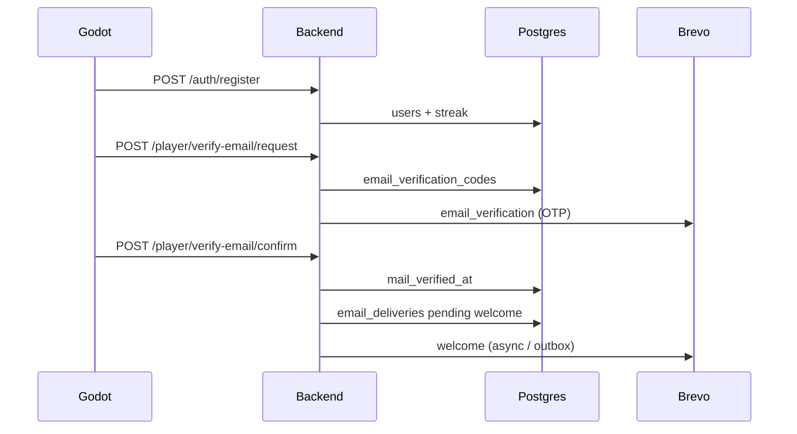

# Arquitectura — Entrega 4 (emails)

> **Stack productivo:** Supabase Edge Functions + Postgres + `pg_cron` → Brevo. Express solo para tests legacy — [EXPRESS_LEGACY](../BACKEND/docs/EXPRESS_LEGACY.md).

Índice: [Resumen](Entrega-4) · [Flujo E3→E4](Entrega-4-Flujo-E3-E4) · [Mails](Entrega-4-Mails)

---

## Qué cambió respecto a Entrega 3

Entrega 3 dejó backend, racha en PostgreSQL y el flag `email_notifications_enabled`, pero **sin envío real**. Entrega 4 cierra el circuito completo:

- Verificación OTP antes de considerar el mail confiable.
- Bienvenida post-verificación (outbox async).
- Recordatorios de racha con consentimiento y dedupe.
- Auditoría en `email_deliveries` con retry y jobs programados.

**Regla de oro:** Godot nunca habla con Brevo. Solo persiste preferencias y dispara eventos HTTP a Edge Functions; el servidor orquesta el envío.

---

## Vista general (Supabase Edge)

```
┌──────────────────────────────────────────────────────────────────────────┐
│                           CLIENTE (Godot)                                │
│  Login / auth.gd        → accept_email_notifications                     │
│  EmailVerification.*    → verify-email-request / confirm (Edge)            │
│  Perfil                 → PATCH email_notifications_enabled              │
│  HUD / StreakLoss       → feedback in-game (paralelo al mail)            │
└───────────────────────────────┬──────────────────────────────────────────┘
                                │ HTTP (api_mode=supabase_edge)
                                ▼
┌──────────────────────────────────────────────────────────────────────────┐
│                    SUPABASE EDGE FUNCTIONS                               │
│  auth-register / auth-login    → registro, login                         │
│  verify-email-*                → OTP, mail_changed, queueWelcomeEmail      │
│  _shared/delivery.ts           → deliverTrackedEmail(), dedupe           │
│  _shared/jobs/email-jobs.ts    → candidatos SQL, reconcile               │
│  internal-job                  → POST con X-Job-Secret (pg_cron)           │
│  brevo-webhook                 → bounce / unsubscribe                    │
└───────────────┬──────────────────────────────┬───────────────────────────┘
                │                              │
                ▼                              ▼
         PostgreSQL (Supabase)           Brevo (SMTP API)
   users, streaks,                  remitente verificado
   email_deliveries,                messageId transaccional
   email_verification_codes

pg_cron ──► internal-job (18:00 / 00:00 / 08:00 / 20:00 ART)
```

### Vista legacy (Express — solo tests locales)

Ver `BACKEND/src/modules/email/` — usado en `npm run test` y desarrollo sin Supabase.

---

## Flujo de verificación y bienvenida



---

## Módulo `BACKEND/src/modules/email/`

| Archivo | Responsabilidad |
|---------|-----------------|
| `email.client.ts` | HTTP a Brevo; payload sender/to/subject/html/text |
| `email.config.ts` | `EMAIL_ENABLED`, keys, timezone, concurrencia, retry |
| `email.service.ts` | Orquestación: welcome, rachas, retry, preview dev |
| `email.repository.ts` | SQL: candidatos, OTP, `acquireDeliverySlot`, auditoría |
| `email.verification.service.ts` | Request/confirm OTP, encolar welcome |
| `email.jobs.routes.ts` | `POST /internal/jobs/streak-emails` y `retry-failed-emails` |
| `email.routes.ts` | Dev: preview, listado deliveries, catálogo templates |
| `templates/*.ts` | Copy + HTML; registry en `templates/index.ts` |
| `assets/` | Logo e íconos embebidos en HTML (CID / inline) |

---

## Catálogo de templates

| `template_key` | Disparador | Consentimiento | Dedupe |
|----------------|------------|----------------|--------|
| `email_verification` | Registro o `verify-email/request` | No (transaccional) | `verify:{userId}:{codeId}` |
| `welcome` | Tras confirmar OTP | No (transaccional) | `welcome` por usuario |
| `mail_changed` | Cambio de mail confirmado | No (seguridad) | Por evento de cambio |
| `streak_at_risk` | Cron 19:00 ART | Sí (`email_notifications_enabled`) | `at_risk:YYYY-MM-DD` |
| `streak_lost` | Mismo cron | Sí | `lost:YYYY-MM-DD` del último día activo |

### Criterio SQL — racha en riesgo

Jugó **ayer** (fecha ART), hoy **sin** actividad, racha `current_count > 0`, mail presente y verificado, notificaciones activas.

### Criterio SQL — racha perdida

Última actividad **hace 2+ días**. Tras el job: mail `streak_lost` (si consentimiento) y `reconcileExpiredStreaksInDatabase` → `current_count = 0`.

---

## Flujo de un envío (auditoría)

```
1. acquireDeliverySlot (TX)
   → INSERT pending o reintento sobre failed
   → skip si ya hay sent/pending con mismo dedupe

2. sendTransactionalEmail (Brevo)
   → provider_message_id

3. markDeliverySent (TX)
   → status = sent
   → afterSent opcional (welcome_email_sent_at, etc.)

Si falla Brevo:
   → markDeliveryFailed + error_message
   → job retry-failed reprocesa dentro de ventana configurada
```

Estados en `email_deliveries`: `pending` → `sent` | `failed` | `skipped`.  
Los `pending` viejos (> 15 min por defecto) expiran a `failed`.

---

## API — endpoints del módulo

### Desarrollo (`NODE_ENV=development`)

| Método | Ruta | Descripción |
|--------|------|-------------|
| GET | `/dev/email/templates` | Metadata + sample params de los 5 templates |
| GET | `/dev/email/preview` | HTML renderizado (`template_key`, `name`, `mail`, `streak_count`) |
| GET | `/dev/email/deliveries` | Listado auditoría (`template_key`, `status`, `limit`) |

### Verificación (requiere JWT)

| Método | Ruta | Descripción |
|--------|------|-------------|
| POST | `/player/verify-email/request` | Genera OTP y encola `email_verification` |
| POST | `/player/verify-email/confirm` | Valida código → `mail_verified_at` + encola `welcome` |

### Jobs internos (header `X-Job-Secret`)

| Método | Ruta | Descripción |
|--------|------|-------------|
| POST | `/internal/jobs/streak-emails` | Candidatos racha + reconcile |
| POST | `/internal/jobs/retry-failed-emails` | Reintento dentro de ventana |
| POST | `/internal/jobs/outbound-emails` | Procesa outbox (welcome pendiente) |

---

## Modelo `email_deliveries`

| Columna | Tipo | Rol |
|---------|------|-----|
| `id` | serial | PK |
| `user_id` | FK → users | Dueño del envío |
| `template_key` | varchar | `welcome`, `streak_at_risk`, … |
| `dedupe_key` | varchar | Idempotencia (`welcome`, `at_risk:2026-06-25`, …) |
| `status` | varchar | `pending` · `sent` · `failed` · `skipped` |
| `recipient_email` | varchar | Destino renderizado |
| `subject` | varchar | Asunto enviado |
| `provider_message_id` | text | ID Brevo (evidencia) |
| `error_message` | text | Si falló |
| `attempt_count` | int | Reintentos sobre la fila |
| `created_at` / `sent_at` / `failed_at` | timestamptz | Timeline |

Índices: `status`, `created_at DESC`, `template_key`, dedupe compuesto (migración `023`).

---

## Cron y entornos

| Horario ART | Job | Mecanismo prod (UTC cron) |
|-------------|-----|---------------------------|
| **19:00** | `streak-emails` | `0 22 * * *` |
| **08:00** | `retry-failed-emails` | `0 11 * * *` |
| **20:00** | `retry-failed-emails` | `0 23 * * *` |

| Entorno | Cómo disparar |
|---------|---------------|
| Dev local | `npm run email:streaks` · `run-email-job.ps1` · Task Scheduler |
| Manual cloud | GitHub Actions `workflow_dispatch` |
| Producción | Schedule + `BACKEND_BASE_URL` secret |

`EMAIL_ENABLED=false` corta **toda** llamada a Brevo (CI, dev sin key).

---

## Relación in-game ↔ mail

| Evento | Godot | Email |
|--------|-------|-------|
| Mail sin verificar | Botón “Verificar mail” en perfil | `email_verification` |
| Cuenta activa | — | `welcome` |
| Cambio de mail | Flujo verificación nuevo mail | `mail_changed` al anterior |
| Racha en riesgo | Badge warning en HUD | `streak_at_risk` |
| Racha perdida | `StreakLossMessagePanel` | `streak_lost` |
| Registro | Checkbox recordatorios | — (hasta verificar) |

El mail **complementa** la experiencia in-game; no la reemplaza.

---

## Migraciones relevantes

| Archivo | Qué agrega |
|---------|------------|
| `021_email_notifications.sql` | `email_notifications_enabled`, `welcome_email_sent_at` |
| `022_email_deliveries_audit.sql` | Tabla `email_deliveries` |
| `023_email_deliveries_retry_indexes.sql` | Índices para retry y dedupe |
| `024_email_verification.sql` | `email_verification_codes`, `mail_verified_at` |
| `028_email_verification_attempts.sql` | Límites de intento OTP |

---

## Variables de entorno (resumen)

Ver `BACKEND/.env.example` y `BACKEND/docs/BREVO_SETUP.md`.

| Variable | Rol |
|----------|-----|
| `EMAIL_ENABLED` | Master switch |
| `BREVO_API_KEY` | Autenticación API |
| `BREVO_SENDER_EMAIL` / `BREVO_SENDER_NAME` | Remitente verificado |
| `EMAIL_TIMEZONE` | Fecha “hoy” para candidatos (default ART) |
| `EMAIL_CRON_SECRET` | Protege jobs HTTP internos |
| `EMAIL_BATCH_CONCURRENCY` | Paralelismo de envío (default 5) |
| `EMAIL_APP_PLAY_URL` | CTA “Jugar” en bienvenida |

---

## Cómo extender (nuevo template)

1. Crear `templates/mi-template.template.ts` con `buildMiTemplate(context)`.
2. Registrar en `templates/index.ts` (metadata + sample).
3. Agregar disparador en `email.service.ts` (o job dedicado).
4. Migración solo si hace falta nuevo índice o columna.
5. Preview: `GET /dev/email/preview?template_key=...`
6. Test: `npm run test:email`
7. Documentar copy en [Entrega-4-Mails](Entrega-4-Mails).

---

## Lo que queda para después

- Deploy productivo con dominio propio (SPF/DKIM/DMARC).
- Mail de recuperación de contraseña (entrega futura).
- Zonas horarias por jugador (hoy: una sola `EMAIL_TIMEZONE`).
