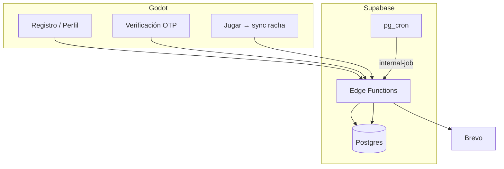
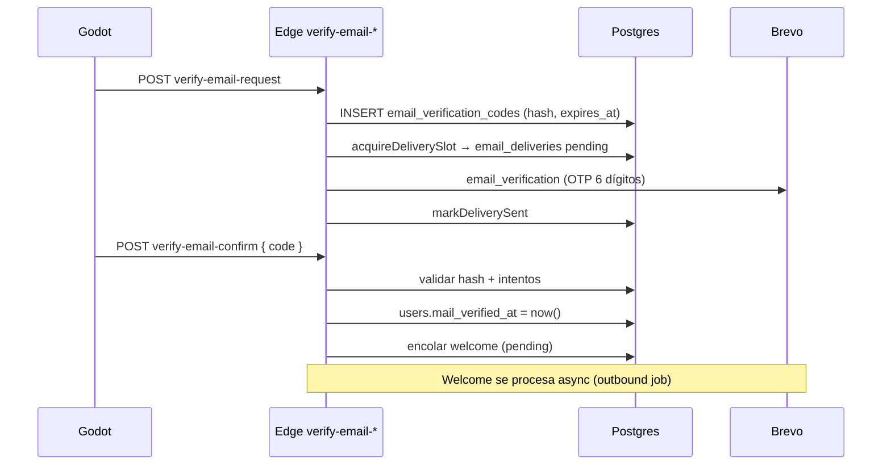

# Entrega 4 — Flujo completo

| Ticket | Resumen | Estado Jira | Qué cubre en E4 |
|--------|---------|-------------|-----------------|
| [UNQ-64](https://tip-unq.atlassian.net/browse/UNQ-64) | Notificaciones email racha en riesgo | Terminado | Jobs diarios, `streak_at_risk`, dedupe, consentimiento |
| [UNQ-177](https://tip-unq.atlassian.net/browse/UNQ-177) | Mail de bienvenida al registrarse | Terminado | Template `welcome` post-OTP (no al registro crudo) |
| [UNQ-190](https://tip-unq.atlassian.net/browse/UNQ-190) | Configurar Brevo con mail de evidente | Terminado | Proveedor, remitente, secrets en Edge |
| [UNQ-149](https://tip-unq.atlassian.net/browse/UNQ-149) | Mensaje de pérdida de racha in-game | Terminado | `StreakLossMessagePanel` + mail `streak_lost` |
| [UNQ-148](https://tip-unq.atlassian.net/browse/UNQ-148) | Diseño mensaje pérdida de racha | Terminado | Base visual del panel de pérdida |
| [UNQ-90](https://tip-unq.atlassian.net/browse/UNQ-90) | Registro de usuario | Terminado | Flujo OTP al alta, opt-in notificaciones |
| [UNQ-27](https://tip-unq.atlassian.net/browse/UNQ-27) | Perfil de usuario | Terminado | Toggle notificaciones, cambio de mail, `mail_changed` |
| [UNQ-83](https://tip-unq.atlassian.net/browse/UNQ-83) | Indicador visual de racha | Terminado | Badge de riesgo en HUD (complemento al mail) |
| [UNQ-178](https://tip-unq.atlassian.net/browse/UNQ-178) | Preferencias notificaciones en perfil | Terminado | Implementado en código |

---

## La historia en orden

Registro hoy en E-VIDENTE:

1. **Se registra** en Godot → la cuenta queda en Postgres (Supabase), con racha en cero y el checkbox de recordatorios.
2. **Recibe un mail con código OTP** de 6 dígitos → no es marketing, es transaccional: necesitamos saber que el mail es real.
3. **Ingresa el código en el juego** → `mail_verified_at` queda guardado. Recién ahí puede usar recordatorios de racha con confianza.
4. **Llega el mail de bienvenida** → unos segundos después, de forma asíncrona (outbox). Si Brevo falla, la cuenta igual quedó activa.
5. **Juega varios días** → la racha sube en servidor cada vez que termina una partida online.
6. **Un día juega a la mañana pero no a la tarde** → a las 18:00 ART el cron detecta “jugó ayer, hoy no” y manda `streak_at_risk` — *solo si* tiene notificaciones activas y mail verificado.
7. **Si pasan 2+ días sin jugar** → a medianoche ART el job manda `streak_lost`, resetea la racha en DB, y al volver al juego ve el panel empático de pérdida.

---

## Arquitectura actual (Supabase + Brevo)

En staging y juego online **no corre Express**. El stack productivo es:

```text
Godot (api_mode=supabase_edge)
  │
  ├─ auth-register / auth-login / player-me
  ├─ verify-email-request / verify-email-confirm
  └─ player-progress-save (actualiza racha en servidor)
        │
        ▼
  Supabase Edge Functions
        │
        ├─ Postgres (users, streaks, email_deliveries, email_verification_codes)
        ├─ Storage (avatares)
        └─ Brevo API (envío transaccional)

pg_cron (dentro de Supabase)
  └─ pg_net ──► Edge: internal-job
                    ├─ streak-at-risk-emails   (18:00 ART)
                    ├─ streak-lost-emails      (00:00 ART)
                    ├─ retry-failed-emails     (08:00 / 20:00 ART)
                    └─ outbound-emails         (welcome pendiente)
```

**Regla de oro:** Godot nunca ve la API key de Brevo. Solo habla HTTP con nuestras Edge Functions; el servidor orquesta Brevo y Postgres.



---

## Los 5 correos y cuándo salen

| # | `template_key` | Disparador | ¿Pide opt-in? | Dedupe |
|---|----------------|------------|---------------|--------|
| 1 | `email_verification` | Registro o pedido de verificación | No | Por código |
| 2 | `welcome` | Tras confirmar OTP | No | `welcome` por usuario |
| 3 | `streak_at_risk` | Cron 18:00 ART | Sí | `at_risk:YYYY-MM-DD` |
| 4 | `streak_lost` | Cron 00:00 ART | Sí | `lost:YYYY-MM-DD` |
| 5 | `mail_changed` | Cambio de mail confirmado | No | Por evento |


---

## Flujo técnico: verificación OTP



**Archivos clave:**
- Edge: `supabase/functions/verify-email-request/`, `verify-email-confirm/`
- Godot: `juego/interface/auth/EmailVerification*.gd`
- Migraciones: `024_email_verification.sql`, `028_email_verification_attempts.sql`

---

## Flujo técnico: un envío con auditoría

Cada mail pasa por el mismo patrón — tanto en Edge como en el módulo Express legacy:

```
1. acquireDeliverySlot (transacción)
   → INSERT pending, o reintento sobre failed
   → skip si ya hay sent/pending con mismo dedupe_key

2. sendTransactionalEmail (Brevo)
   → guarda provider_message_id

3. markDeliverySent
   → status = sent

Si falla:
   → markDeliveryFailed + error_message
   → job retry-failed reprocesa con backoff (+10 min, +1 h, +6 h; máx 4 intentos)
```

Estados en `email_deliveries`: `pending` → `sent` | `failed` | `skipped`.

**Implementación Edge:** `supabase/functions/_shared/delivery.ts`  
**Implementación Express (tests):** `BACKEND/src/modules/email/email.repository.ts`

---

## Flujo técnico: jobs de racha

### Racha en riesgo (`streak_at_risk`)

**Criterio SQL (simplificado):**
- `streaks.current_count > 0`
- Última actividad = **ayer** (fecha ART)
- Hoy **sin** actividad registrada
- `users.mail_verified_at IS NOT NULL`
- `users.email_notifications_enabled = true`

**Horario:** 18:00 ART vía `pg_cron` → `internal-job` con `job: streak-at-risk-emails`.

### Racha perdida (`streak_lost`)

**Criterio:** última actividad hace **2 o más días**.

**Horario:** 00:00 ART → `streak-lost-emails`.

### Tabla de crons

| Job `pg_cron` | Horario ART | Edge `internal-job` |
|---------------|-------------|---------------------|
| `evidente-streak-at-risk` | 18:00 | `streak-at-risk-emails` |
| `evidente-streak-lost` | 00:00 | `streak-lost-emails` |
| `evidente-retry-failed-am` | 08:00 | `retry-failed-emails` |
| `evidente-retry-failed-pm` | 20:00 | `retry-failed-emails` |

Setup: `npm run setup:supabase:cron` · Smoke: `npm run smoke:cron:staging`

---

## Qué se construyó (por capa)

### Infraestructura — Supabase

| Pieza | Qué hace |
|-------|----------|
| Proyecto Supabase staging | Postgres managed + Edge Functions + Storage |
| Migraciones `021`–`028` | Notificaciones, auditoría, OTP, índices retry |
| `pg_cron` + `pg_net` | Dispara jobs sin depender de GitHub Actions |
| `private.cron_invocation_log` | Observabilidad de cada invocación |
| Secrets en Edge | `BREVO_*`, `EMAIL_CRON_SECRET`, `JWT_SECRET` |

Comando todo-en-uno: `npm run integrate:staging`

### Backend — Módulo email

| Pieza | Ubicación |
|-------|-----------|
| Cliente Brevo | `_shared/brevo.ts` (Edge) · `email.client.ts` (Express) |
| Templates HTML | `_shared/email/templates/*.ts` |
| Jobs de racha | `_shared/jobs/email-jobs.ts` |
| Webhook bounce | `brevo-webhook` Edge function |
| Auditoría | `email_deliveries` + `delivery.ts` |

### Cliente — Godot

| Pieza | Qué hace |
|-------|----------|
| `auth.gd` / `Login.tscn` | Checkbox `accept_email_notifications` al registrarse |
| `EmailVerification.tscn` | UI OTP request/confirm |
| Perfil | Toggle notificaciones, botón “Verificar mail” |
| HUD | Badge de racha en riesgo |
| `StreakLossMessagePanel` | Mensaje in-game al perder racha |

### Operación

| Comando | Para qué |
|---------|----------|
| `npm run verify:integration:full` | Validación integral staging (~3 min) |
| `npm run platform:doctor:staging` | Diagnóstico “no llegan mails” |
| `npm run smoke:verify-email-edge` | OTP end-to-end |
| `npm run smoke:brevo-edge` | Brevo accesible desde Edge |
| `npm run smoke:cron:staging` | Simula un cron manual |

---

## Desafíos que encontramos y cómo los resolvimos

| Problema | Qué pasaba | Solución |
|----------|------------|----------|
| Mails duplicados | Cron o retry corría dos veces | `dedupe_key` + estado `pending` bloquea reenvío |
| Mails a cuentas falsas | Typo en registro → spam a terceros | OTP obligatorio antes de welcome y recordatorios |
| Brevo caído, racha expirada | Jugador con racha desactualizada | Reconcile independiente del envío |
| Envíos accidentales en CI | Tests mandaban mails reales | `EMAIL_ENABLED=false` por defecto |
| Godot con API key expuesta | Riesgo de seguridad | Solo Edge/Backend hablan con Brevo |
| Usuarios viejos sin notificaciones | Registro mandaba `accept_email_notifications=false` hardcodeado | Corregido; activar desde perfil o SQL |
| Mails en spam | Sender Gmail sin dominio propio | Documentado; dominio propio pendiente prod |
| Express vs Supabase | Dos stacks, confusión | Express = legacy tests; staging = Edge |
| Cron en GitHub | Dependencia externa, secrets | Migrado a `pg_cron` nativo en Supabase |
