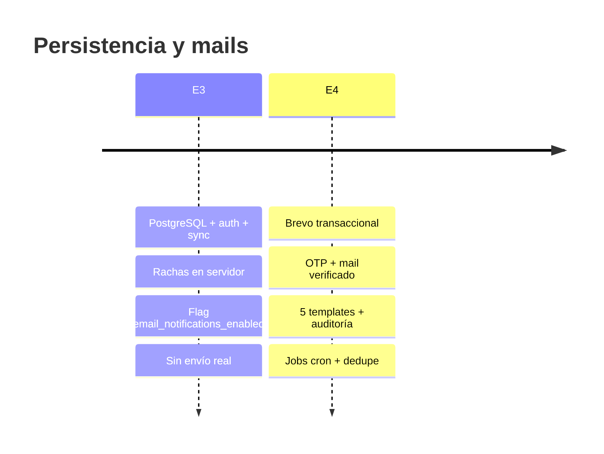

# Flujo E3 → E4 — Evolución de persistencia y notificaciones

Cómo la Entrega 3 preparó el terreno y la Entrega 4 activó el canal de correo sin romper el modelo dual local + PostgreSQL.

Índice: [Entrega 3](Entrega-3) · [Entrega 4](Entrega-4) · [MER persistencia E3](Mer-Persistencia-E3)

---

## Línea de tiempo



---

## Qué ya existía en E3 (reutilizado en E4)

| Componente E3 | Uso en E4 |
|---------------|-----------|
| Tabla `users` + columna `mail` | Destino de OTP y recordatorios |
| `email_notifications_enabled` | Filtro SQL en jobs de racha |
| Tabla `streaks` + `last_activity_day` | Candidatos `streak_at_risk` / `streak_lost` |
| `AuthApi` / `auth.gd` | Registro envía `accept_email_notifications` |
| `PATCH /player/me` | Toggle de notificaciones en perfil |
| Docker + migraciones | Base para `email_deliveries` y OTP |

**No hubo que reescribir el sync ni la racha in-game.** E4 es una capa transversal sobre infraestructura E3.

---

## Qué se agregó en E4

| Capa | Nuevo en E4 |
|------|-------------|
| **Proveedor** | Cliente HTTP Brevo (`email.client.ts`) |
| **Dominio mail** | Módulo `email/` con service, repository, templates |
| **Verificación** | `email_verification_codes`, `mail_verified_at`, UI Godot |
| **Auditoría** | `email_deliveries` con estados, dedupe, retry |
| **Operación** | Jobs internos, cron GH Actions, scripts Windows |
| **Contenido** | 5 templates HTML + texto plano versionados en git |

---

## Diagrama de datos (extensión E4)

```
users                          streaks
├── mail                       ├── current_count
├── email_notifications_enabled├── last_activity_day
├── mail_verified_at    ← NEW  └── user_id (FK)
└── welcome_email_sent_at ← NEW

email_deliveries ← NEW          email_verification_codes ← NEW
├── template_key                ├── user_id
├── dedupe_key                  ├── code_hash
├── status (pending/sent/...)   ├── expires_at
├── provider_message_id         └── attempt_count
└── recipient_email
```

Relación con MER E3: [Mer-Persistencia-E3](Mer-Persistencia-E3)

---

## Flujo del jugador: E3 vs E4

### Entrega 3 — registro y racha

```
Registro → Login → Jugar → Sync racha → HUD muestra racha
                ↓
         (checkbox notificaciones guardado, sin mail)
```

### Entrega 4 — mismo flujo + correos

```
Registro → OTP mail → Verificar en juego → Welcome mail
    ↓
Login → Jugar online → Racha en servidor
    ↓
Job 19:00 ART → streak_at_risk (si opt-in + mail verificado)
    ↓
2+ días off → streak_lost + reconcile + StreakLossMessagePanel
```

---

## Decisiones de continuidad

| Tema | E3 | E4 |
|------|----|----|
| Save local offline | Sigue siendo fuente de verdad sin login | Sin cambios |
| Racha offline vs servidor | Merge al loguear | Job usa **solo** datos servidor |
| Recuperación contraseña | Endpoint existe, sin mail real | Sigue fuera de alcance E4 |
| Leaderboard | Fuera de E3 | Backend avanzó en paralelo; mails no dependen de él |

---

## Referencias cruzadas

- Sync detallado E3: [Sync-Godot-Postgres](Sync-Godot-Postgres)
- Evento in-game ↔ mail: `juego/niveles/progress/README.md`
- Bitácora E3: [Bitacora-Entrega-3](Bitacora-Entrega-3)
- Bitácora E4: [Bitacora-Entrega-4](Bitacora-Entrega-4)
