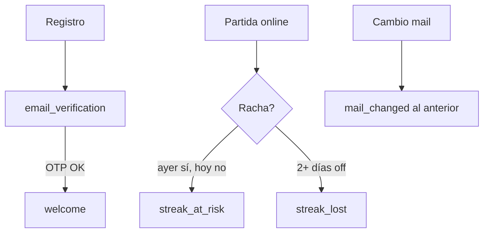

# Mails — redacción y operación (Entrega 4)

Guía editorial para los **5 correos transaccionales** de E-VIDENTE. Fuente de verdad antes de tocar TypeScript.

**Revisor TTIP:** [Guía rápida 5 min](Entrega-4-Guia-Rapida) · [Resumen](Entrega-4) · [Arquitectura](Entrega-4-Arquitectura) · [Evidencia](Entrega-4-Evidencia)

---

## Catálogo rápido

| # | `template_key` | Cuándo | Consentimiento | Opt-out racha |
|---|----------------|--------|----------------|---------------|
| 1 | `email_verification` | Registro o cambio de mail | No | — |
| 2 | `welcome` | Tras confirmar OTP | No | — |
| 3 | `streak_at_risk` | Job 19:00 ART, jugó ayer | Sí | Sí |
| 4 | `streak_lost` | Job, 2+ días sin jugar | Sí | Sí |
| 5 | `mail_changed` | Cambio de mail confirmado | No (seguridad) | — |



---

## Voz y tono

| Principio | Cómo se aplica |
|-----------|----------------|
| Cercano, no infantil | Voseo rioplatense; sin exceso de emojis |
| Breve | Un mensaje = una idea; párrafos cortos |
| Honesto | OTP explícito; bienvenida solo tras verificar |
| Pedagógico | Recordar que se aprende jugando, sin sermonear |
| Respetuoso | Opt-out visible en mails de racha; bienvenida sin presión |

**Marca:** **E-VIDENTE** (mayúsculas en marca).  
**Cierre estándar:** `Equipo E-VIDENTE`  
**Footer HTML:** *E-VIDENTE — aprender jugando sobre restricciones alimentarias.*

---

## Anatomía de cada mail

1. **Asunto** — decide si abren (~50 caracteres ideal).
2. **Headline** — titular del bloque verde (HTML).
3. **Subtitle** — contexto bajo el titular.
4. **Cuerpo** — saludo + mensaje + (opcional) opt-out.

Siempre: versión **texto plano** y **HTML** con el mismo significado.

---

## Copy aprobado

### 1. Verificación OTP (`email_verification`)

**Cuándo:** al registrarse con mail o al solicitar verificación desde perfil (`POST /player/verify-email/request`). **No** es la bienvenida.

| Campo | Texto |
|-------|-------|
| **Asunto** | `Código E-VIDENTE: {código} (verificá tu mail)` |
| **Headline** | `Verificá tu email` |
| **Subtitle** | `Código válido por {N} minutos` |

**Cuerpo:**

> Hola {nombre},
>
> Tu código de verificación es: **{código}** (6 números seguidos, sin espacios). Válido por {N} minutos.
>
> Copiá el código del asunto o de este mail y pegalo en el juego.
>
> 1. Abrí E-VIDENTE  
> 2. Pegá el código en la pantalla de verificación  
> 3. Listo — tu cuenta quedará confirmada
>
> Si no lo pediste vos, ignorá este mensaje.

**Tono:** instructivo, sin alarmismo. El código va también en el **asunto** para copiar rápido desde la bandeja.

---

### 2. Bienvenida (`welcome`)

**Cuándo:** **después** de `POST /player/verify-email/confirm`. Sin verificar → **no** se encola. Outbox async (`EMAIL_PROCESS_ON_STARTUP` o `npm run email:run-local`).

| Campo | Texto |
|-------|-------|
| **Asunto** | `Mail verificado — Bienvenido/a a E-VIDENTE` |
| **Headline** | `Mail verificado` |
| **Subtitle** | `Tu cuenta está lista` |

**Cuerpo:**

> ¡Hola {nombre}!
>
> Confirmaste tu mail correctamente. Ya podés entrar al juego, sumar experiencia y empezar tu racha diaria.
>
> Aprender sobre restricciones alimentarias nunca fue tan entretenido. ¡Que disfrutes el camino!

**CTAs HTML (opcionales):** enlace a jugar (`EMAIL_APP_PLAY_URL`) y ranking.

**Evitar en UI:** *“te enviamos el mail de bienvenida”* antes de verificar el código.

---

### 3. Racha en riesgo (`streak_at_risk`)

**Cuándo:** jugó **ayer** (ART), **hoy no** hay actividad en servidor. Requiere mail verificado, `email_notifications_enabled = true`, racha `> 0`, y job ejecutado. **No** al abrir Godot.

| Campo | Texto |
|-------|-------|
| **Asunto** | `Tu racha de {N} días sigue en juego — jugá hoy` |
| **Headline** | `Tu racha sigue en juego` |
| **Subtitle** | `Entrá hoy para mantenerla` |

**Cuerpo:**

> Hola {nombre},
>
> Llevás **{N} días** de racha, pero hoy todavía no registramos que hayas jugado. Entrá y completá una partida para no perderla.
>
> Podés desactivar los recordatorios de racha desde tu cuenta en el juego.

**Tono:** urgencia suave, sin culpa.

---

### 4. Racha perdida (`streak_lost`)

**Cuándo:** 2+ días sin actividad. El job envía el mail y **reconcilia** `current_count = 0` en Postgres.

| Campo | Texto |
|-------|-------|
| **Asunto** | `Tu racha se reinició — podés arrancar otra cuando quieras` |
| **Headline** | `Tu racha se reinició` |
| **Subtitle** | `Siempre podés volver a empezar` |

**Cuerpo:**

> Hola {nombre},
>
> Pasaron varios días sin actividad y tu racha de **{N} días** volvió a cero. No pasa nada: cada día es una nueva oportunidad para aprender jugando.
>
> Podés desactivar los recordatorios de racha desde tu cuenta en el juego.

**Tono:** empático. Alineado a `StreakLossMessagePanel`.

---

### 5. Cambio de mail (`mail_changed`)

**Cuándo:** se confirma un nuevo mail en perfil. Se envía al **mail anterior** como aviso de seguridad.

| Campo | Texto |
|-------|-------|
| **Asunto** | `Aviso de seguridad: tu email en E-VIDENTE fue cambiado` |
| **Headline** | `Tu email fue cambiado` |
| **Subtitle** | `Aviso de seguridad de cuenta` |

**Cuerpo:**

> Hola {nombre},
>
> Te avisamos que el email asociado a tu cuenta en E-VIDENTE fue actualizado.  
> Nuevo email: **{nuevo_mail}**
>
> Si fuiste vos, podés ignorar este mensaje.  
> Si **no** reconocés este cambio, contactanos de inmediato.

**Tono:** serio pero calmado; checklist de pasos si no fue el usuario.

---

## Checklist antes de publicar un cambio de copy

- [ ] Asunto distinto por template.
- [ ] `{nombre}`, `{N}`, `{código}` escapados en HTML (`escapeHtml`).
- [ ] Texto plano = mismo mensaje que HTML.
- [ ] Mails de racha incluyen opt-out.
- [ ] Bienvenida y OTP **sin** opt-out de racha.
- [ ] Preview dev de los 5 templates.
- [ ] `npm run test:email` en verde.
- [ ] Prueba en Gmail + móvil (spam, legibilidad).

---

## Cómo implementar un cambio (paso a paso)

### 1. Editar en wiki primero

Acordar copy acá → después TypeScript. Evita sorpresas de producto.

### 2. Actualizar template TypeScript

| Template | Archivo |
|----------|---------|
| OTP | `email-verification.template.ts` |
| Bienvenida | `welcome.template.ts` |
| Racha riesgo | `streak-at-risk.template.ts` |
| Racha perdida | `streak-lost.template.ts` |
| Mail cambiado | `mail-changed.template.ts` |

Registrar metadata en `templates/index.ts`.

### 3. Verificar sin enviar

```bash
cd BACKEND && npm run dev
```

Previews (reemplazá `localhost:3000` si usás otro puerto):

```
/dev/email/preview?template_key=email_verification&name=Agus&mail=test@example.com
/dev/email/preview?template_key=welcome&name=Agus&mail=test@example.com
/dev/email/preview?template_key=streak_at_risk&name=Agus&streak_count=7
/dev/email/preview?template_key=streak_lost&name=Agus&streak_count=12
/dev/email/preview?template_key=mail_changed&name=Agus
```

### 4. Probar envío real

`.env`: `EMAIL_ENABLED=true` + Brevo. Ver `BACKEND/docs/BREVO_SETUP.md`.

```bash
docker compose up -d
npm run validate:email-flow
npm run smoke:email-verification
npm run seed:streak-email-demo -- --run-job
```

### 5. Alinear copy en Godot

| Lugar | Qué revisar |
|-------|-------------|
| `juego/API/Login.tscn` | Checkbox recordatorios; hint de verificación (no bienvenida prematura) |
| `juego/interface/auth.tscn` | Toggle recordatorios en perfil |
| `EmailVerification.tscn` | Textos del flujo OTP |
| `ProfileOverlayPanel` | *“Recordatorios mail: Sí/No”* |

---

## Diseño visual

Tokens en `templates/layout.ts` (`GAME_EMAIL_THEME`):

| Token | Valor | Uso |
|-------|-------|-----|
| Verde primario | `#42785e` | Header, énfasis |
| Crema | `#f4f7f2` | Fondo |
| Marrón acento | `#704533` | Racha perdida |
| Radio card | `28px` | Paneles del juego |

Tipografía: **Rubik** (Google Fonts). Íconos en `assets/icons/` (welcome, mail, streak, security, alert).

---

## Operación — FAQ

| Pregunta | Respuesta |
|----------|-----------|
| ¿Mail al abrir Godot? | **No** (salvo outbox pendiente al iniciar backend). |
| ¿Aviso instantáneo de racha perdida? | **No.** Batch diario vía job. |
| ¿Qué datos usa el job? | Postgres (`streaks.last_activity_day`), no solo save offline. |
| ¿Cron en local? | `register-email-tasks-windows.ps1` o `npm run email:run-local`. |

**Flujo mínimo `streak_at_risk`:**

1. Mail verificado + notificaciones ON + partida online.
2. `last_activity_day` = ayer (o `npm run seed:streak-email-demo`).
3. `npm run email:streaks`.
4. Bandeja + `email_deliveries` con `status=sent`.

---

## Próximos mails (fuera de E4)

| Mail | Notas |
|------|-------|
| Recuperación de contraseña | Link firmado con TTL |
| Resumen semanal | Job nuevo + consentimiento distinto |
