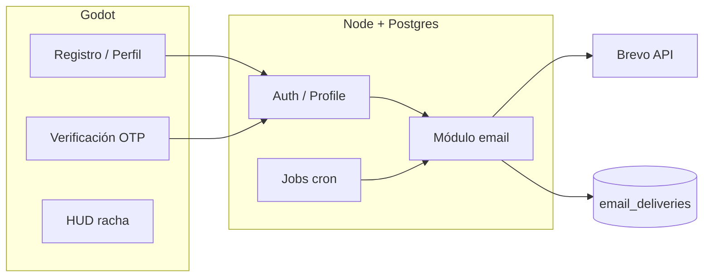

# Entrega 4 — E-VIDENTE

> **Resumen en una línea:** el juego puede hablar con el jugador fuera de la pantalla — con mails transaccionales auditados, verificación OTP y recordatorios de racha que respetan el consentimiento.

**¿Primera vez acá?** → [Guía rápida (5 min)](Entrega-4-Guia-Rapida) · Estado: [ESTADO-ACTUAL.md](../ESTADO-ACTUAL.md) · Índice: [Entregas](Entregas)

---

## Para el revisor TTIP

| Pregunta | Respuesta en 1 click |
|----------|---------------------|
| ¿Qué entregamos? | 5 correos + OTP + jobs + auditoría (tabla abajo) |
| ¿Cómo lo pruebo rápido? | [Guía rápida — validación express](Entrega-4-Guia-Rapida#validación-express-elige-una) |
| ¿Dónde está la evidencia? | [Evidencia E4](Entrega-4-Evidencia) |
| ¿Qué cambió vs E3? | [Flujo E3→E4](Entrega-4-Flujo-E3-E4) |
| ¿Por qué estas decisiones? | [Decisiones](Entrega-4-Decisiones) |

---

## Resumen ejecutivo

Entrega 3 dejó backend, racha en PostgreSQL y flags de notificación, pero **sin correos reales**. Entrega 4 cierra el circuito:

1. **Verificación OTP** — `email_verification` al registrarse o cambiar mail.
2. **Bienvenida** — `welcome` solo tras confirmar el código.
3. **Recordatorios de racha** — `streak_at_risk` y `streak_lost` con opt-in.
4. **Seguridad** — `mail_changed` al mail anterior si cambian la cuenta.
5. **Auditoría** — `email_deliveries` con dedupe, retry y cron programado.

**Regla de oro:** Godot nunca habla con Brevo. Solo HTTP al backend; el servidor orquesta Brevo y Postgres.

---

## Qué se agregó o modificó

| Área | Entregable | Archivos clave |
|------|------------|----------------|
| **Proveedor** | Brevo API + `EMAIL_ENABLED` | `email.client.ts`, `email.config.ts` |
| **Templates** | 5 correos TS + preview + tests | `templates/*.ts` |
| **Verificación** | OTP 6 dígitos + UI Godot | `email.verification.*`, `EmailVerification.*` |
| **Consentimiento** | Registro + perfil | `auth.gd`, `PATCH /player/me` |
| **Rachas** | Job 19:00 ART, dedupe, reconcile | `email.jobs.routes.ts`, `send-streak-emails.ts` |
| **Operación** | Local, npm, GitHub Actions | `scripts/local/`, `email-cron.yml` |
| **Diseño** | Rubik, verde/crema, íconos CID | `templates/layout.ts`, `assets/` |
| **In-game** | Badge riesgo + panel pérdida | `StreakLossMessagePanel`, HUD |

---

## Desafíos técnicos resueltos

| Desafío | Solución | Validación |
|---------|----------|------------|
| Duplicados (cron/retry) | `dedupe_key` + estado `pending` | `email.jobs.integration.test.ts` |
| Transaccional vs marketing | OTP/welcome sin opt-in; rachas con flag | SQL candidatos |
| Zona horaria racha | `EMAIL_TIMEZONE` ART | Job + seed demo |
| Envíos en CI/dev | `EMAIL_ENABLED=false` default | `npm run test` |
| Brevo caído, racha expirada | Reconcile independiente del mail | Test integración |
| Mail falso / typo | OTP obligatorio antes de recordatorios | UI + `mail_verified_at` |

---

## Alcance de Entrega 4

| Bloque | Resultado | Estado |
|--------|-----------|--------|
| Módulo email (Brevo) | Cliente, service, repository, 5 templates | ✅ Listo |
| Verificación OTP | Request/confirm + UI Godot | ✅ Listo |
| Mail de bienvenida | Post-verificación, outbox async | ✅ Listo |
| Aviso cambio de mail | Notificación al mail anterior | ✅ Listo |
| Racha en riesgo | Cron 19:00 ART + SQL | ✅ Listo |
| Racha perdida | Mail + reconcile | ✅ Listo |
| Reintento fallidos | Job 08:00 y 20:00 ART | ✅ Listo |
| Consentimiento UI | Login + perfil | ✅ Listo |
| Auditoría | `email_deliveries` + dev API | ✅ Listo |
| Copy editorial | Wiki + assets | ✅ Listo |
| Tests integración | Jobs, dedupe, webhook | ✅ Listo |
| Validación E2E | `validate:email-flow` | ✅ Jun 2026 |
| Activación producción | Dominio + secrets GH | ⏳ Deploy |

### Fuera de alcance

Recuperación de contraseña por mail · Newsletters · Push nativas · Editor visual templates.

Ver [Próximos pasos](Entrega-4-Proximos-Pasos) para la iteración siguiente.

---

## Comandos npm (referencia)

| Comando | Qué hace | Cuándo usarlo |
|---------|----------|---------------|
| `npm run test:email` | Unitarios + envío opcional 5 templates | Validación rápida |
| `npm run test` | Suite completa backend | CI / pre-PR |
| `npm run validate:email-flow` | E2E local con Brevo | Demo / defensa |
| `npm run smoke:email` | Config + previews + deliveries | Smoke operativo |
| `npm run smoke:email-verification` | Flujo OTP HTTP | Regresión auth |
| `npm run email:streaks` | Job rachas manual | Demo streak |
| `npm run seed:streak-email-demo` | Usuario demo + racha ayer | Preparar demo |
| `npm run email:retry-failed` | Reintento fallidos | Ops |

Todos desde `BACKEND/`. Detalle: [Evidencia](Entrega-4-Evidencia).

---

## Trazabilidad commit → entregable

| Commit | Descripción | Bloque |
|--------|-------------|--------|
| `60a3694` | Integración inicial mails | Módulo Brevo |
| `f13fb6f` | Cron y jobs internos | Operación |
| `911d334` | Rachas perdidas + tests | Jobs |
| `84ea2dc` | Wiki E4 inicial | Docs |
| `0c8e813` | Mail verificado en auth | OTP |
| `8647176` | Verificación backend | OTP |
| `8c5cf75` | Verificación Godot | OTP UI |
| `e5acdfe` | Auditoría verificación | OTP |
| `c40f99e` | Assets visuales templates | Diseño |

---

## Documentación

| Página | Contenido |
|--------|-----------|
| [Guía rápida](Entrega-4-Guia-Rapida) | **Empezá acá** — 5 min para revisores |
| [User Stories](Entrega-4-User-Stories) | 7 US con criterios de aceptación |
| [Arquitectura](Entrega-4-Arquitectura) | Diagramas, endpoints, SQL, cron |
| [Flujo E3→E4](Entrega-4-Flujo-E3-E4) | Evolución desde backend E3 |
| [Mails](Entrega-4-Mails) | Copy aprobado de los 5 correos |
| [Decisiones](Entrega-4-Decisiones) | ADRs y alternativas descartadas |
| [Evidencia](Entrega-4-Evidencia) | Demo TTIP, tests, checklist |
| [Próximos pasos](Entrega-4-Proximos-Pasos) | Post-E4 y candidatos E5 |
| [Bitácora E4](Bitacora-Entrega-4) | Cronología |

### Referencia en código

- `BACKEND/src/modules/email/README.md`
- `BACKEND/docs/BREVO_SETUP.md`
- `juego/niveles/progress/README.md`

---

## Continuidad con Entrega 3

E4 **extiende** E3 sin reemplazar sync ni save local. Detalle: [Flujo E3→E4](Entrega-4-Flujo-E3-E4) · [Entrega 3](Entrega-3)
