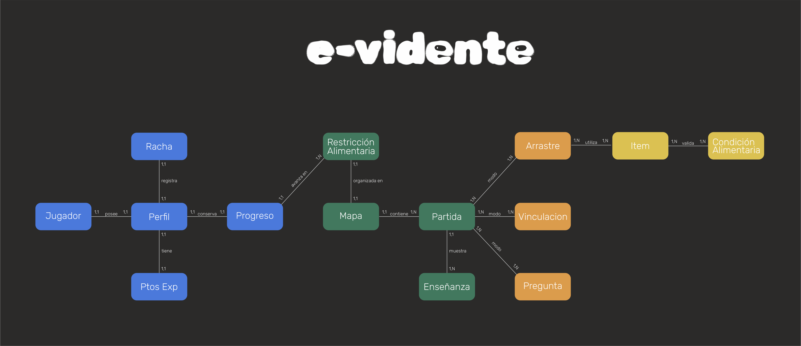

# MER Dominio · E1/E2 · vista interactiva

Diagrama **Excalidraw** original del dominio del juego (jugador, mapa, modalidades, ítems). La persistencia en E1/E2 era solo local; E3 agrega capa remota sin cambiar el dominio conceptual.

---

## Abrir

**[▶ Dominio E1/E2 — pantalla completa](https://raw.githack.com/TTIP-e-vidente/e-vidente/dev/wiki/mer-dominio.html?v=3)**

Imagen estática en wiki: 

---

## Relacionado

| Doc | Link |
|-----|------|
| Persistencia E3 | [Mer-Persistencia-E3](Mer-Persistencia-E3) |
| Hub MER | [Mer-Hub](Mer-Hub) |
| Entrega 1 arquitectura | [Entrega-1-Arquitectura](Entrega-1-Arquitectura) |
| MER (texto) | [MER](MER) |
| Índice de vistas | [Vistas-Interactivas](Vistas-Interactivas) |
