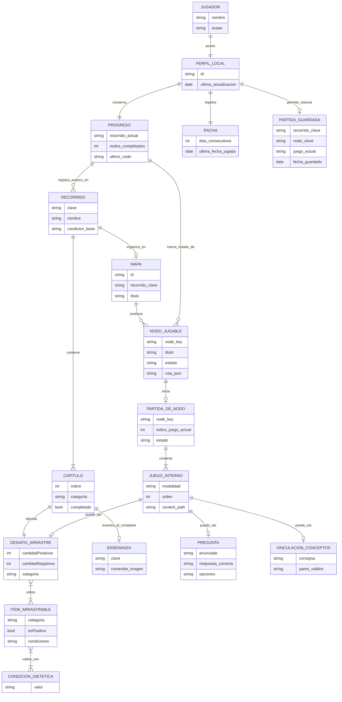

# Modelo Entidad-Relación lógico de E-VIDENTE

E-VIDENTE organiza la experiencia del jugador como un recorrido educativo. La persona no entra simplemente a resolver actividades aisladas: avanza por recorridos temáticos, supera desafíos y construye un progreso que puede retomarse más adelante.

Este documento presenta el Modelo Entidad-Relación lógico del proyecto. No describe una base de datos física ni una implementación SQL. Su objetivo es mostrar qué entidades existen en el producto, cómo se relacionan y cómo sostienen el flujo principal de la aplicación.

> **El MER describe el modelo lógico del flujo jugable. El Modelo Relacional traduce ese modelo a una posible estructura tabular, sin afirmar que exista una base SQL implementada.**

## Estado del relevamiento

Este MER se construyó a partir de dos fuentes de distinto nivel de certeza:

| Fuente | Estado |
|---|---|
| Código fuente verificado en rama actual (`project/`) | **Confirmado** |
| Documentación wiki, Bitácora y commits registrados (archivos referenciados pero no encontrados en rama actual) | **Falta confirmar en rama** |

Los archivos verificados en la rama actual son: `project/niveles/global.gd`, `project/niveles/nivel_1/Level.gd`, `project/niveles/nivel_2/Level-Vegan.gd`, `project/niveles/nivel_3/Level-Vegan-GF.gd`, `project/niveles/manager_level.gd`, `project/resources/level_resource.gd`, `project/resources/level_item.gd`, `project/items/ItemLevel.gd` y los ~80 recursos `.tres` de alimentos en `project/items/`.

Los archivos referenciados en Bitácora y wiki pero **no encontrados en la rama actual** incluyen: `project/mapas/MapScene.gd`, `project/mapas/logica/ArmadorDePartida.gd`, `project/mapas/logica/AbridorDeNodoJugable.gd`, `project/mapas/logica/ContinuidadDePartidaDeNodo.gd`, `project/sistemas/NodoRuntime.gd`, `project/niveles/GameSceneRouter.gd`, `project/preguntas/pregunta.gd`, `project/vincular/vincular_conceptos.gd`, `project/interface/SaveManager.gd`, `project/interface/progress_bar.gd`, `project/mapas/finalización_partida.gd`, y todos los archivos JSON de contenido. No se encontraron archivos `.json` en `project/contenido/` porque la carpeta no existe en la rama actual. El contenido está definido en Resources `.tres` y arrays en `global.gd`.

## Alcance del modelo

Este MER no representa tablas reales ni una base de datos relacional implementada. La demo actual funciona en Godot, con contenido definido en Resources (`.tres`), escenas jugables y persistencia de estado en variables de `Global`.

El objetivo del diagrama es mostrar:

- cómo se organiza el contenido educativo;
- cómo avanza el jugador por recorridos y capítulos;
- cómo se conectan recorridos, nodos y actividades de arrastre;
- qué información está confirmada en código real;
- qué entidades están documentadas (Bitácora/wiki) pero pendientes de verificar en código.

## Flujo funcional confirmado por código

El flujo verificado en la rama actual es:

1. La persona jugadora entra al flujo principal (`evidente.gd → intro.tscn`).
2. Elige un recorrido temático seleccionando un libro: `libro.tscn` (Celiaquía), `libro-vegan.tscn` (Veganismo) o `Libro-Vegan-GF.tscn` (Vegan+GF). **Evidencia:** `interface/libro.gd`.
3. El libro muestra 6 capítulos; cada uno se habilita al completar el anterior (`items_level[n][6]`). **Evidencia:** `interface/libro.gd`.
4. El jugador selecciona un capítulo → se fija `Global.current_level` → se abre la escena de nivel. **Evidencia:** `niveles/global.gd`.
5. `manager_level.gd` configura el desafío leyendo los datos del capítulo activo desde `LevelResource` y los arrays de `Global`. **Evidencia:** `manager_level.gd`, `level_resource.gd`.
6. El jugador arrastra alimentos al plato. Los items tienen condiciones y categorías (`LevelItem.Condicion[]`, `categoria`). **Evidencia:** `level_item.gd`, `items/ItemLevel.gd`.
7. Al completar, `_victory()` marca el capítulo como completado (`items_level[n][6] = true`) y muestra la enseñanza. **Evidencia:** `nivel_1/Level.gd`.

**Flujo adicional documentado en Bitácora** (archivos no encontrados en rama actual):  
mapa → nodo jugable → partida por nodo → juegos internos → modalidad → progreso → finalización → guardado local.  
Referencias: [entrega-1/Arquitectura.md](entrega-1/Arquitectura.md), [Bitacora.md](Bitacora.md).

## Diagrama editable

Este MER no está cargado como imagen estática. Está escrito en Mermaid dentro de la Wiki, por lo que puede editarse desde el propio Markdown. GitHub renderiza el gráfico automáticamente, pero la fuente real sigue siendo texto versionable.

Las entidades y atributos marcados con comentario `%% [Falta confirmar]` están documentados en Bitácora o wiki pero sus archivos de código **no se encontraron en la rama actual**.

Vista interactiva auxiliar: [wiki/assets/mer-diagrama.html](assets/mer-diagrama.html) — no reemplaza a este Markdown como fuente canónica.

## MER lógico principal (Mermaid editable)

## Diccionario entre código y MER

Esta tabla explica la equivalencia entre los nombres reales del proyecto (código, Resources) y las entidades del MER. Los scripts no son entidades; aparecen aquí solo como evidencia técnica.

| Nombre en código / Resource | Representa en el MER | Tipo | Estado | Evidencia |
|---|---|---|---|---|
| `items_level` (dict en global.gd) | RECORRIDO (Celiaquía, 6 capítulos) | variable de estado | **Confirmado** | `project/niveles/global.gd` |
| `items_level_vegan` (dict en global.gd) | RECORRIDO (Veganismo, 6 capítulos) | variable de estado | **Confirmado** | `project/niveles/global.gd` |
| `items_level_vegan_gf` (dict en global.gd) | RECORRIDO (Vegan+GF, 6 capítulos) | variable de estado | **Confirmado** | `project/niveles/global.gd` |
| `Global.current_level` (int 1-6) | CAPITULO.indice | atributo | **Confirmado** | `project/niveles/global.gd` |
| `items_level[n]` (array de 7 posiciones) | CAPITULO (sub-nivel n de un recorrido) | entrada de datos | **Confirmado** | `project/niveles/global.gd` |
| `items_level[n][0]` | DESAFIO_ARRASTRE.cantidadNegativos | atributo | **Confirmado** | `global.gd` |
| `items_level[n][1]` | DESAFIO_ARRASTRE.cantidadPositivos | atributo | **Confirmado** | `global.gd` |
| `items_level[n][5]` | CAPITULO.categoria (ALMCENA / DESAMER / BEBIDA) | atributo | **Confirmado** | `global.gd` |
| `items_level[n][6]` | CAPITULO.completado (bool) | atributo | **Confirmado** | `global.gd`, `libro.gd` |
| `LevelResource.itemsPositivos[]` | lista de ITEM_ARRASTRABLE con esPositivo=true | relación | **Confirmado** | `project/resources/level_resource.gd` |
| `LevelResource.itemsNegativos[]` | lista de ITEM_ARRASTRABLE con esPositivo=false | relación | **Confirmado** | `project/resources/level_resource.gd` |
| `LevelResource.cantidadPositivos` | DESAFIO_ARRASTRE.cantidadPositivos | atributo | **Confirmado** | `project/resources/level_resource.gd` |
| `LevelResource.cantidadNegativos` | DESAFIO_ARRASTRE.cantidadNegativos | atributo | **Confirmado** | `project/resources/level_resource.gd` |
| `LevelItem.condiciones[]` (Array[Condicion]) | ITEM_ARRASTRABLE.condiciones → CONDICION_DIETETICA | relación | **Confirmado** | `project/resources/level_item.gd` |
| `LevelItem.Condicion` (enum) | CONDICION_DIETETICA (valores: KETO, CELIACO, VEGANO, DIABETICO, VEGETARIANO) | catálogo/enum | **Confirmado** | `project/resources/level_item.gd` |
| `LevelItem.esPositivo` | ITEM_ARRASTRABLE.esPositivo | atributo bool | **Confirmado** | `project/resources/level_item.gd` |
| `LevelItem.categoria` | ITEM_ARRASTRABLE.categoria | atributo | **Confirmado** | `project/resources/level_item.gd` |
| `Ensenanzas.ENSENANZA_CELIAQUIA_N` | ENSENANZA (catálogo de enseñanzas) | atributo/catálogo | **Confirmado** | `project/niveles/ensenanzas.gd` |
| `manager_level.gd` | orquesta DESAFIO_ARRASTRE con LevelResource | evidencia técnica (no entidad) | **Confirmado** | `project/niveles/manager_level.gd` |
| `Level.gd._victory()` | marca CAPITULO.completado | evidencia técnica (no entidad) | **Confirmado** | `project/niveles/nivel_1/Level.gd` |
| `libro.gd` | selección de CAPITULO por RECORRIDO | evidencia técnica (no entidad) | **Confirmado** | `project/interface/libro.gd` |
| `items/*.tres` (~80 archivos) | instancias de ITEM_ARRASTRABLE (alimentos individuales) | recursos | **Confirmado** | `project/items/*.tres` |
| `track_key` | RECORRIDO.clave | atributo | **Falta confirmar** | entrega-1/Arquitectura.md (MapScene.gd no encontrado) |
| `node_key` | NODO_JUGABLE.node_key | atributo | **Falta confirmar** | entrega-1/Arquitectura.md |
| `plan_de_partida` | PARTIDA_DE_NODO | entidad lógica | **Falta confirmar** | Bitácora (commit 5-may), ArmadorDePartida.gd no encontrado |
| `juegos[]` (dentro de plan_de_partida) | JUEGO_INTERNO[] | array de juegos internos | **Falta confirmar** | Bitácora (commit 5-may) |
| `modalidad` / `mode` | JUEGO_INTERNO.modalidad | atributo | **Falta confirmar** | entrega-1/Arquitectura.md (GameSceneRouter.gd no encontrado) |
| `SaveManager.gd` | evidencia de PERFIL_LOCAL + PARTIDA_GUARDADA | evidencia técnica (no entidad) | **Falta confirmar** | Bitácora, archivo no encontrado en rama |
| `ArmadorDePartida.gd` | construye PARTIDA_DE_NODO | evidencia técnica (no entidad) | **Falta confirmar** | Bitácora (5-may), archivo no encontrado |
| `ContinuidadDePartidaDeNodo.gd` | gestiona avance de JUEGO_INTERNO en PARTIDA_DE_NODO | evidencia técnica (no entidad) | **Falta confirmar** | Bitácora, archivo no encontrado |
| `GameSceneRouter.gd` | enruta hacia modalidad de JUEGO_INTERNO | evidencia técnica (no entidad) | **Falta confirmar** | Arquitectura.md, archivo no encontrado |
| `celiaquia_mapa.json` | datos de MAPA + NODO_JUGABLE para track celiaquía | JSON de contenido | **Falta confirmar** | Arquitectura.md, JSON no encontrado en rama |
| `pregunta.gd` | implementa modalidad PREGUNTA dentro de JUEGO_INTERNO | evidencia técnica (no entidad) | **Falta confirmar** | Bitácora (10-may), archivo no encontrado |
| `vincular_conceptos.gd` | implementa VINCULACION_CONCEPTOS dentro de JUEGO_INTERNO | evidencia técnica (no entidad) | **Falta confirmar** | Bitácora, archivo no encontrado |

## Cómo editar este MER

Guía simple para editar el diagrama sin romper el render en GitHub:

1. Agregar una entidad nueva: declarar sus atributos en un bloque propio.
2. Crear la relación con otra entidad usando cardinalidad.
3. Verificar que los nombres técnicos no usen espacios, acentos ni caracteres raros.
4. Si la entidad está confirmada por código, agregar el comentario `%% Confirmado: archivo.gd`.
5. Si la entidad está pendiente de verificar, agregar el comentario `%% Falta confirmar`.

Cardinalidades útiles: `||` exactamente uno · `o|` cero o uno · `|{` uno o muchos · `o{` cero o muchos.

## Tabla de entidades

| Entidad | Nombre en código | Responsabilidad | Atributos reales | Estado | Evidencia |
|---|---|---|---|---|---|
| RECORRIDO | `items_level`, `items_level_vegan`, `items_level_vegan_gf` | Trayecto temático (Celiaquía, Veganismo, Vegan+GF). Agrupa CAPITULO. | clave (impl.), nombre, condicion_base | **Confirmado** | `global.gd`, `libro.gd` |
| CAPITULO | `items_level[n]` (entrada 1-6) | Sub-nivel dentro de un recorrido; se habilita secuencialmente. | indice (`current_level`), categoria, completado | **Confirmado** | `global.gd`, `libro.gd`, `Level.gd` |
| DESAFIO_ARRASTRE | `LevelResource` + `ManagerLevel` | Actividad drag-and-drop: clasificar alimentos en el plato. | cantidadPositivos, cantidadNegativos, categoria | **Confirmado** | `level_resource.gd`, `manager_level.gd` |
| ITEM_ARRASTRABLE | `LevelItem` (.tres) + `Item_level` (escena) | Alimento individual arrastrable con condiciones y categoría. | condiciones[], esPositivo, categoria, sprite | **Confirmado** | `level_item.gd`, `ItemLevel.gd`, `items/*.tres` |
| CONDICION_DIETETICA | `LevelItem.Condicion` (enum) | Condición dietética que categoriza si un alimento es válido. | KETO, CELIACO, VEGANO, DIABETICO, VEGETARIANO | **Confirmado** | `level_item.gd` |
| ENSENANZA | `Ensenanzas` + `Ensenanzaveganismo` | Contenido educativo mostrado al completar el capítulo. | clave, contenido_imagen | **Confirmado** | `ensenanzas.gd`, `ensenanzaveganismo.gd` |
| JUGADOR | (actor conceptual, sin clase explícita) | Persona que usa la app. Entidad conceptual; lo persistido es PERFIL_LOCAL. | nombre, avatar | **Actor conceptual** | No modelado como clase. |
| PERFIL_LOCAL | `SaveManager.gd` (no encontrado) | Identidad persistida localmente. | id, ultima_actualizacion | **Falta confirmar** | Bitácora, wiki. Archivo no encontrado. |
| PROGRESO | `global.gd` (parcial: flags) + `SaveManager.gd` (no encontrado) | Estado de avance. En rama actual: solo flags de completado por capítulo. | recorrido_actual, nodos_completados, ultimo_nodo | **Parcialmente confirmado** | `global.gd` (flags), SaveManager no encontrado. |
| RACHA | assets-sistema/racha-diaria/ (assets) | Continuidad diaria de juego. Assets UI existen; código no encontrado. | dias_consecutivos, ultima_fecha_jugada | **Falta confirmar** | Assets existen, código no encontrado. |
| PARTIDA_GUARDADA | `SaveManager.gd` (no encontrado) | Punto de reanudación de partida. | recorrido_clave, nodo_clave, juego_actual, fecha_guardado | **Falta confirmar** | Bitácora. Archivo no encontrado. |
| MAPA | `MapScene.gd` (no encontrado) | Estructura visual de nodos de un recorrido. | id, recorrido_clave, titulo | **Falta confirmar** | assets-sistema/mapa/ existen. Código no encontrado. |
| NODO_JUGABLE | (equivalente actual: CAPITULO via items_level[n]) | Unidad jugable en el mapa. En aspiracional: seleccionable desde MapScene. | node_key, titulo, estado, ruta_json | **Falta confirmar** | Arquitectura.md. Equivalente actual: CAPITULO. |
| PARTIDA_DE_NODO | `ArmadorDePartida.gd` (no encontrado), `plan_de_partida` | Secuencia activa de juegos internos en un nodo. | node_key, indice_juego_actual, estado | **Falta confirmar** | Bitácora (5-may). Archivo no encontrado. |
| JUEGO_INTERNO | `juegos[]` en plan_de_partida (no encontrado) | Actividad puntual según modalidad. | modalidad, orden, content_path | **Falta confirmar** | Bitácora. Archivos no encontrados. |
| PREGUNTA | `pregunta.gd` (no encontrado) | Variante quiz de JUEGO_INTERNO. | enunciado, respuesta_correcta, opciones | **Falta confirmar** | assets-sistema/preguntas/ existen. Código no encontrado. |
| VINCULACION_CONCEPTOS | `vincular_conceptos.gd` (no encontrado) | Variante de asociación de conceptos. | consigna, pares_validos | **Falta confirmar** | Bitácora. Archivo no encontrado. |

## Tabla de relaciones

| Relación MER | Flujo real en código | Cardinalidad | Estado | Evidencia |
|---|---|---|---|---|
| RECORRIDO contiene CAPITULO | `items_level`/`items_level_vegan`/`items_level_vegan_gf` tienen 6 entradas (1-6) | 1 a 6 (N fijo) | **Confirmado** | `global.gd` |
| CAPITULO ejecuta DESAFIO_ARRASTRE | `manager_level.setup()` usa `items_level[current_level]` para configurar `LevelResource` | 1 a 1 | **Confirmado** | `manager_level.gd`, `level_resource.gd` |
| DESAFIO_ARRASTRE utiliza ITEM_ARRASTRABLE | `LevelResource.itemsPositivos[]` y `itemsNegativos[]` referencian `LevelItem` | 1 a N | **Confirmado** | `level_resource.gd`, `items/*.tres` |
| ITEM_ARRASTRABLE valida_con CONDICION_DIETETICA | `LevelItem.condiciones[]` es `Array[LevelItem.Condicion]` | N a N | **Confirmado** | `level_item.gd` |
| CAPITULO muestra_al_completar ENSENANZA | `Level._victory()` muestra `level_resource.ensenanza` y setea `items_level[n][6] = true` | 1 a 0..1 | **Confirmado** | `nivel_1/Level.gd`, `ensenanzas.gd` |
| JUGADOR posee PERFIL_LOCAL | `SaveManager.gd` (no encontrado) | 1 a 1 | **Falta confirmar** | Bitácora |
| PERFIL_LOCAL conserva PROGRESO | `SaveManager.gd` (no encontrado) | 1 a 1 | **Falta confirmar** | Bitácora |
| PERFIL_LOCAL registra RACHA | `SaveManager.gd` (no encontrado) | 1 a 1 | **Falta confirmar** | Bitácora |
| PERFIL_LOCAL permite_retomar PARTIDA_GUARDADA | `SaveManager.gd` (no encontrado) | 1 a 0..1 | **Falta confirmar** | Bitácora |
| RECORRIDO organiza_en MAPA | `MapScene.gd` (no encontrado) | 1 a 0..1 | **Falta confirmar** | Arquitectura.md |
| MAPA contiene NODO_JUGABLE | `MapScene.gd` + JSON de nodos (no encontrados) | 1 a N | **Falta confirmar** | Arquitectura.md |
| NODO_JUGABLE inicia PARTIDA_DE_NODO | `AbridorDeNodoJugable.gd` + `ArmadorDePartida.gd` (no encontrados) | 1 a 0..1 | **Falta confirmar** | Bitácora (5-may) |
| PARTIDA_DE_NODO contiene JUEGO_INTERNO | `juegos[]` dentro de `plan_de_partida` (no encontrado) | 1 a N | **Falta confirmar** | Bitácora (5-may) |
| JUEGO_INTERNO puede_ser PREGUNTA | `pregunta.gd` + `GameSceneRouter.gd` (no encontrados) | 1 a 0..1 | **Falta confirmar** | Arquitectura.md, assets UI |
| JUEGO_INTERNO puede_ser DESAFIO_ARRASTRE | `Level.gd` + `manager_level.gd` (confirmados como modalidad arrastre) | 1 a 0..1 | **Confirmado** (modalidad base) | `level_resource.gd` |
| JUEGO_INTERNO puede_ser VINCULACION_CONCEPTOS | `vincular_conceptos.gd` (no encontrado) | 1 a 0..1 | **Falta confirmar** | Bitácora |
| PROGRESO registra_avance_en RECORRIDO | Parcial: `items_level[n][6]` en `global.gd`; SaveManager no encontrado | 1 a N | **Parcialmente confirmado** | `global.gd` (flags) |
| PROGRESO marca_estado_de NODO_JUGABLE | `SaveManager.gd` (no encontrado) | 1 a N | **Falta confirmar** | Bitácora |

## Evidencia técnica (fuera del modelo de dominio)

Estos artefactos técnicos justifican cómo se implementa el flujo, pero no son entidades de negocio en el MER:

**Confirmados en rama actual:**
- Arrastre y setup: [project/niveles/manager_level.gd](../project/niveles/manager_level.gd), [project/items/ItemLevel.gd](../project/items/ItemLevel.gd).
- Selección de capítulo: [project/interface/libro.gd](../project/interface/libro.gd), [project/interface/libro-vegan.gd](../project/interface/libro-vegan.gd).
- Estado global y recorridos: [project/niveles/global.gd](../project/niveles/global.gd).
- Recursos de items: [project/resources/level_resource.gd](../project/resources/level_resource.gd), [project/resources/level_item.gd](../project/resources/level_item.gd).

**Referenciados en Bitácora/wiki pero NO encontrados en rama actual:**
- Routing y apertura de nodo: `project/mapas/MapScene.gd`, `project/mapas/logica/AbridorDeNodoJugable.gd`, `project/mapas/logica/ContinuidadDePartidaDeNodo.gd`, `project/sistemas/NodoRuntime.gd`.
- Plan de partida: `project/mapas/logica/ArmadorDePartida.gd`.
- Modalidades: `project/niveles/GameSceneRouter.gd`, `project/preguntas/pregunta.gd`, `project/vincular/vincular_conceptos.gd`.
- Persistencia: `project/interface/SaveManager.gd`, `project/interface/progress_bar.gd`.
- Cierre de nodo: `project/mapas/finalización_partida.gd`.
- Contenido JSON: ningún archivo `.json` encontrado en `project/` (carpeta `contenido/` no existe en rama).

## Separación MER / Modelo Relacional

El MER describe el modelo lógico del flujo jugable: qué entidades existen, cómo se relacionan y qué atributos tienen.

El Modelo Relacional traduce ese modelo a una posible estructura tabular, sin afirmar que exista una base SQL implementada.

No mezclar: MER ≠ tablas físicas · MR lógico ≠ base SQL implementada · Script Godot ≠ entidad MER.

Ver: [entrega-1/Modelo-Relacional.md](entrega-1/Modelo-Relacional.md)

## Vista interactiva auxiliar

[wiki/assets/mer-diagrama.html](assets/mer-diagrama.html) es una visualización de apoyo generada con Cytoscape.js. **No es la fuente canónica del MER.** La fuente canónica es este archivo Markdown. Si el HTML queda desactualizado respecto a este documento, tiene prioridad el Markdown.

## Criterio TTIP para defensa

- El diagrama principal es un MER lógico en formato `erDiagram`. No hay `classDiagram`.
- Los scripts (`manager_level.gd`, `ArmadorDePartida.gd`, `SaveManager.gd`, etc.) aparecen solo como evidencia técnica, no como entidades.
- Los atributos de entidades confirmadas usan nombres reales del código (`cantidadPositivos`, `esPositivo`, `condiciones[]`, `current_level`, `items_level[n][6]`).
- Todo lo no verificable en código de rama actual está marcado como "Falta confirmar".
- El diccionario código → MER permite trazabilidad directa entre variables y entidades.

Pendientes de revisión manual:
- Confirmar si archivos referenciados en Bitácora están en otra rama y sincronizar cuando se mergeen.
- Validar cardinalidades finales del MER una vez consolidados todos los archivos.
- Decidir si JUGADOR y PERFIL_LOCAL se unificarán o mantendrán separados según criterio TTIP.

[MR lógico](entrega-1/Modelo-Relacional.md) · [Arquitectura Entrega 1](entrega-1/Arquitectura.md) · [Bitácora](Bitacora.md)

