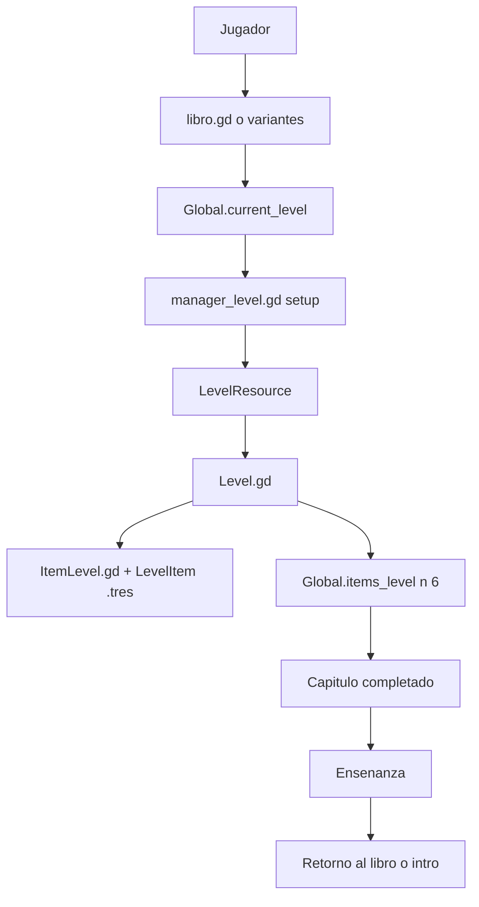

# Arquitectura — Entrega 1

Este documento describe la arquitectura defendible de Entrega 1 a partir del código realmente visible en esta rama. No intenta vender una plataforma completa ni una arquitectura enterprise. Su foco es la demo local en Godot.

## User story testigo

**Como** jugador,  
**quiero** abrir un nodo jugable, completar sus actividades internas y ver mi progreso,  
**para** entender mi avance y continuar el recorrido educativo sin perder contexto.

### Aclaración para defensa

La redacción de la historia mantiene el lenguaje de producto usado en la wiki. Sin embargo, en esta rama el equivalente técnico confirmado no es `MapScene.gd`, sino la selección de un `CAPITULO` desde las escenas `libro.gd`, `libro-vegan.gd` y `Libro-Vegan-GF.gd`. Por eso, el flujo se presenta en dos capas: confirmado y falta confirmar.

## Flujo confirmado por código

### Componentes confirmados

| Componente | Rol en Entrega 1 | Estado |
|---|---|---|
| [project/interface/libro.gd](../../project/interface/libro.gd) | Permite elegir capítulo y leer si está desbloqueado | Confirmado |
| [project/interface/libro-vegan.gd](../../project/interface/libro-vegan.gd) | Variante del selector para otro recorrido | Confirmado |
| [project/interface/Libro-Vegan-GF.gd](../../project/interface/Libro-Vegan-GF.gd) | Variante del selector para otro recorrido | Confirmado |
| [project/niveles/global.gd](../../project/niveles/global.gd) | Guarda `current_level` y flags de completado por recorrido | Confirmado |
| [project/niveles/manager_level.gd](../../project/niveles/manager_level.gd) | Configura el desafío activo a partir del estado global | Confirmado |
| [project/niveles/nivel_1/Level.gd](../../project/niveles/nivel_1/Level.gd) | Ejecuta la actividad y marca victoria | Confirmado |
| [project/resources/level_resource.gd](../../project/resources/level_resource.gd) | Define cantidades, imágenes y listas de ítems del capítulo | Confirmado |
| [project/resources/level_item.gd](../../project/resources/level_item.gd) | Define atributos del alimento arrastrable | Confirmado |
| [project/items/ItemLevel.gd](../../project/items/ItemLevel.gd) | Comportamiento visual e interactivo del ítem arrastrable | Confirmado |
| [project/niveles/ensenanzas.gd](../../project/niveles/ensenanzas.gd) | Catálogo de enseñanzas del recorrido | Confirmado |
| [project/niveles/ensenanzaveganismo.gd](../../project/niveles/ensenanzaveganismo.gd) | Variante de enseñanzas para otro recorrido | Confirmado |

## Componentes esperados o mencionados en wiki, pero falta confirmar

Estos nombres sí son relevantes para la defensa porque aparecen en la documentación histórica del proyecto. La forma correcta de presentarlos hoy es como piezas esperadas o registradas en Bitácora, no como implementaciones comprobadas en esta rama.

| Componente esperado | Qué representaría | Estado |
|---|---|---|
| `MapScene.gd` | Mapa con nodos jugables | Falta confirmar |
| `AbridorDeNodoJugable.gd` | Apertura del nodo elegido | Falta confirmar |
| `ArmadorDePartida.gd` | Construcción de partida por nodo | Falta confirmar |
| `ContinuidadDePartidaDeNodo.gd` | Avance entre juegos internos | Falta confirmar |
| `GameSceneRouter.gd` | Enrutamiento por modalidad | Falta confirmar |
| `pregunta.gd` | Modalidad de pregunta | Falta confirmar |
| `vincular_conceptos.gd` | Modalidad de vinculación | Falta confirmar |
| `Progress_Bar.tscn` / `progress_bar.gd` | Progreso visual transversal | Falta confirmar |
| `SaveManager.gd` | Persistencia local explícita | Falta confirmar |
| JSON de contenido | Datos externos por nodo o mapa | Falta confirmar |

## Lectura técnica corta

1. El jugador abre uno de los libros de recorrido y selecciona un capítulo habilitado.
2. El libro actualiza `Global.current_level`.
3. `manager_level.gd` arma el `LevelResource` que se jugará en ese capítulo.
4. `Level.gd` ejecuta el desafío de arrastre con ítems definidos por `LevelItem` y los `.tres` del proyecto.
5. Al completar el desafío, `Level.gd` marca el capítulo como completado en `Global.items_level[n][6]`.
6. El sistema muestra una enseñanza y luego vuelve al flujo de selección.

## Relación con el MER

El MER explica entidades de negocio. Esta página muestra el recorrido técnico mínimo que hoy puede defenderse con evidencia concreta.

- [MER lógico](../Modelo-Entidad-Relacion.md)
- [MR lógico](Modelo-Relacional.md)
- [Arquitectura general](../Architecture.md)

## Alcance de esta arquitectura

Esta arquitectura cubre una demo local en Godot. No afirma backend, base de datos real, autenticación online, leaderboard ni servicios externos. Cuando esos conceptos aparezcan en otros documentos, deben leerse como alcance futuro o como partes "Falta confirmar" en esta rama.
