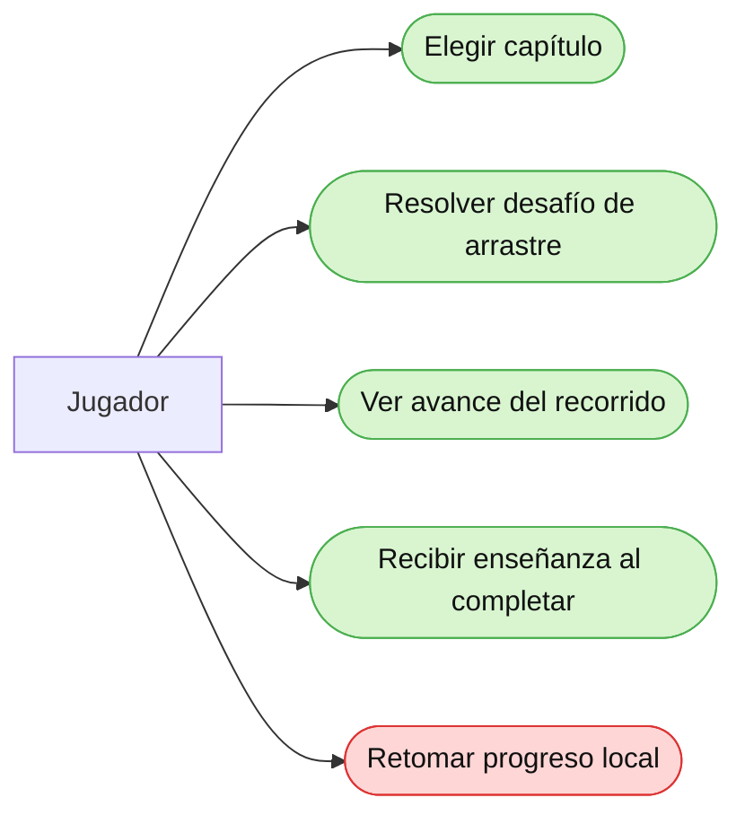

# Casos de Uso — Entrega 1

## Objetivo

Esta página resume los casos de uso visibles desde la perspectiva del jugador en la demo que sí puede defenderse con evidencia de esta rama. Se evita mezclar aquí funcionalidades históricas o aspiracionales como si ya estuvieran implementadas.

## Actor principal

**Jugador**

Persona que usa E-VIDENTE para recorrer contenido educativo y resolver actividades simples dentro de la demo local.

## Diagrama de casos de uso

## Casos de uso Entrega 1

### CU-01 — Elegir capítulo

El jugador puede abrir un recorrido y seleccionar un capítulo habilitado.

**Criterios observables:**

- Hay una vista de libro o selector de recorrido.
- Los capítulos muestran habilitación según el progreso.
- Al tocar un capítulo disponible, comienza la actividad asociada.

**Estado:** Confirmado.

**Evidencia:**

- [project/interface/libro.gd](../../project/interface/libro.gd)
- [project/interface/libro-vegan.gd](../../project/interface/libro-vegan.gd)
- [project/interface/Libro-Vegan-GF.gd](../../project/interface/Libro-Vegan-GF.gd)
- [project/niveles/global.gd](../../project/niveles/global.gd)

### CU-02 — Resolver desafío de arrastre

El jugador puede interactuar con alimentos arrastrables y completar una actividad.

**Criterios observables:**

- El sistema muestra ítems interactivos.
- El jugador puede arrastrarlos dentro de la escena.
- El resultado de la actividad permite llegar a una victoria.

**Estado:** Confirmado.

**Evidencia:**

- [project/niveles/nivel_1/Level.gd](../../project/niveles/nivel_1/Level.gd)
- [project/items/ItemLevel.gd](../../project/items/ItemLevel.gd)
- [project/niveles/manager_level.gd](../../project/niveles/manager_level.gd)

### CU-03 — Ver avance del recorrido

El jugador puede identificar qué capítulos ya completó.

**Criterios observables:**

- El sistema marca capítulos completados.
- El siguiente capítulo se habilita según el progreso.
- El jugador entiende dónde quedó dentro del recorrido.

**Estado:** Confirmado.

**Evidencia:**

- [project/niveles/global.gd](../../project/niveles/global.gd)
- [project/interface/libro.gd](../../project/interface/libro.gd)
- [project/niveles/nivel_1/Level.gd](../../project/niveles/nivel_1/Level.gd)

### CU-04 — Recibir enseñanza al completar

El jugador ve un cierre pedagógico al terminar el capítulo.

**Criterios observables:**

- Al completar la actividad, se muestra una enseñanza.
- La actividad no termina de forma abrupta.
- El cierre refuerza el contenido educativo.

**Estado:** Confirmado.

**Evidencia:**

- [project/niveles/nivel_1/Level.gd](../../project/niveles/nivel_1/Level.gd)
- [project/niveles/ensenanzas.gd](../../project/niveles/ensenanzas.gd)
- [project/niveles/ensenanzaveganismo.gd](../../project/niveles/ensenanzaveganismo.gd)

### CU-05 — Retomar progreso local

El jugador recupera su avance entre una sesión y otra.

**Criterios observables:**

- Existe guardado persistente.
- Al reabrir el juego se recupera el progreso.
- El flujo retoma un estado anterior sin reiniciar todo.

**Estado:** Falta confirmar.

**Evidencia:**

- [Persistencia-Local.md](../Persistencia-Local.md)
- [Bitacora.md](../Bitacora.md)

Motivo: no se encontró un archivo verificable de persistencia local en `project/` dentro de esta rama.

**Evidencia:**

- [CI.md](../CI.md)
- [wiki/entrega-1/Evidencia.md](Evidencia.md)
- [project/tests/vertical_slice_smoke_test.gd](../../project/tests/vertical_slice_smoke_test.gd)

Falta confirmar:
- Ejecución local de validación en esta rama.

## Relación con User Stories

| Caso de uso | User story relacionada | Documento |
|---|---|---|
| CU-01 | US-01 Perfil y persistencia local | [User-Stories.md](User-Stories.md) |
| CU-02 | US-02 Guardado parcial de actividad | [User-Stories.md](User-Stories.md) |
| CU-03 | US-04 Partida por nodo con juegos internos | [User-Stories.md](User-Stories.md) |
| CU-04 | US-04 Partida por nodo con juegos internos | [User-Stories.md](User-Stories.md) |
| CU-05 | US-08 Corrección del comportamiento del plato | [User-Stories.md](User-Stories.md) |
| CU-06 | US-04 Partida por nodo con juegos internos | [User-Stories.md](User-Stories.md) |
| CU-07 | US-07 Vinculación de conceptos | [User-Stories.md](User-Stories.md) |
| CU-08 | US-05 Barra de progreso | [User-Stories.md](User-Stories.md) |
| CU-09 | US-06 Lección terminada / finalización de nodo | [User-Stories.md](User-Stories.md) |
| CU-10 | US-09 Validaciones CI / smoke | [User-Stories.md](User-Stories.md) |

## Cierre

Esta página complementa a [User-Stories.md](User-Stories.md): ahí está la redacción funcional de cada historia y acá queda el mapa visual de uso para defender la entrega frente al tutor.

Pendiente de revisión manual del equipo: validar cardinalidades finales del MER.
